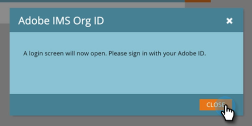

# アドビ組織マッピングの設定 {#set-up-adobe-organization-mapping}

Audience ManagerなどのAdobeアプリケーションと同期するために、B2B CDP Marketoコネクタ [!DNL Dynamic Chat]など ) の場合は、まず「Marketo Engage」にAdobe IMS組織の資格情報を入力する必要があります。

>[!NOTE]
>
>* Marketo インスタンスの HIPAA 対応デプロイメントでは、この統合を使用できません。
>* 統合が機能するには、Marketoとその他のAdobeアプリケーションが同じ組織に存在する必要があります。

>[!IMPORTANT]
>
>AdobeビジネスプラットフォームとIdentity Managementシステムに転送されたユーザーの場合、サブスクリプションに関連付けられている組織 ID は既に入力されており、読み取り専用フィールドになります。 したがって、この記事の手順は適用されません。

1. Marketo で、「**[!UICONTROL 管理者]**」をクリックします。

   

1. 統合で、「**[!UICONTROL アドビ組織マッピング]**」をクリックします。

   

1. 「**[!UICONTROL 編集]**」をクリックします。

   

1. Adobe IMS組織 ID を入力します（見つけ方を学ぶ）。 [ここ](https://experienceleague.adobe.com/docs/control-panel/using/faq.html){target="_blank"}) をクリックし、 **[!UICONTROL OK]**.

   

1. 「**[!UICONTROL 確認]**」をクリックします。

   

1. 「**[!UICONTROL 閉じる]**」をクリックします。

   

   >[!IMPORTANT]
   >
   >セキュリティ上の理由から、マッピング先のアドビ組織の組織管理者である必要があります。さもないと、アクションは失敗します。また、アドビユーザと Marketo ユーザは、ログイン時に同じメールアドレスを使用する必要があります。

1. _まだログインしていない_&#x200B;場合は、新しいタブ／ウィンドウにポップアップが表示されます。アドビ組織にログインします（このアクションで組織アクセスが検証されます）。

これで完了です。次の操作を実行できます。 [オーディエンスデータを共有](/help/marketo/product-docs/core-marketo-concepts/smart-lists-and-static-lists/static-lists/send-a-list-to-adobe-experience-cloud.md){target="_blank"} to, or [sync an audience](/help/marketo/product-docs/adobe-experience-cloud-integrations/sync-an-audience-from-adobe-experience-cloud.md){target="_blank"} Adobe Experience Cloudから
