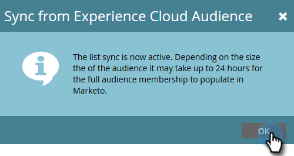

# Adobe Experience Cloud からのオーディエンスの同期 {#sync-an-audience-from-adobe-experience-cloud}

>[!NOTE]
>
>Marketo インスタンスの HIPAA 対応デプロイメントでは、この統合を使用できません。

>[!PREREQUISITES]
>
>[組織マッピングAdobeの設定](/help/marketo/product-docs/adobe-experience-cloud-integrations/set-up-adobe-organization-mapping.md){target=&quot;_blank&quot;}

## オーディエンスの同期方法 {#how-to-sync-an-audience}

1. My Marketo で、「**データベース**」タイルをクリックします。

   

1. 「**新規**」ドロップダウンをクリックして、「**Experience Cloud オーディエンスから同期**」を選択します。

   

1. 「**オーディエンスライブラリフォルダー**」ドロップダウンリストをクリックして、目的の元フォルダーを選択します。

   

1. **オーディエンス名**&#x200B;を選択します。

   

1. 宛先については、既存のリストを選択するか、新しいリストの名前を入力できます。この例では、新しく作成します。終了したら「**同期**」をクリックします。

   

1. 「**OK**」をクリックします。

   

## よくある質問 {#faq}

**Cookie の同期は、どのような仕組みなのですか？**

Marketoサブスクリプションに対して cookie 同期が有効になっている場合、Marketoの munchkin.js は、統合の設定時に指定したAdobe IMS組織のAdobeECID を取得して保存し、これらの ECID を対応するMarketoの Cookie 識別子に一致させます。 これにより、Marketoの匿名ユーザープロファイルをAdobeECID で強化できます。

匿名ユーザープロファイルをリードプロファイルに関連付けるには、さらに手順を実行する必要があります。リードプロファイルは、テキスト形式メールで識別されます。これの仕組み [こちらで説明します。](/help/marketo/product-docs/reporting/basic-reporting/report-activity/tracking-anonymous-activity-and-people.md){target=&quot;_blank&quot;}。

**Marketo のリストサイズがアドビのリストサイズと異なるのはなぜですか？**

Marketo の既知のユーザーに ECID Cookie ID を関連付けることができない場合、ユーザーも同期されません。

**これは 1 回限りの同期ですか？**

同期を開始する必要があるのは 1 回だけです。その後、レコードは自動的に同期されます。初期同期には最大 24 時間かかる場合があります。その後、新しいレコードは 2～3 時間で同期されます。
