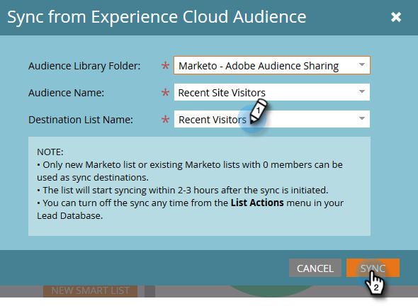

# Adobe Experience Cloud からのオーディエンスの同期 {#sync-an-audience-from-adobe-experience-cloud}

>[!NOTE]
>
>Marketo インスタンスの HIPAA 対応デプロイメントでは、この統合を使用できません。

>[!PREREQUISITES]
>
>[アドビ組織マッピングの設定](/help/marketo/product-docs/adobe-experience-cloud-integrations/set-up-adobe-organization-mapping.md){target="_blank"}

## オーディエンスの同期方法 {#how-to-sync-an-audience}

1. My Marketo で、「**[!UICONTROL データベース]**」タイルをクリックします。

   

1. 「**[!UICONTROL 新規]**」ドロップダウンをクリックして、「**[!UICONTROL Experience Cloud オーディエンスから同期]**」を選択します。

   

1. 「**[!UICONTROL オーディエンスライブラリフォルダー]**」ドロップダウンリストをクリックして、目的の元フォルダーを選択します。

   

1. **[!UICONTROL オーディエンス名]**&#x200B;を選択します。

   

1. 宛先については、既存のリストを選択するか、新しいリストの名前を入力できます。 この例では、新しいリストが作成されています。 終了したら「**[!UICONTROL 同期]**」をクリックします。

   

1. 「**[!UICONTROL OK]**」をクリックします。

   

## よくある質問 {#faq}

**Cookie の同期は、どのよう仕組みなのですか？**

Marketo サブスクリプションでcookie syncが有効になっている場合、Marketoのmunchkin.jsは、統合の設定中に指定したAdobe IMS組織のAdobe ECIDを取得して保存し、これらのECIDを対応するMarketo Cookie IDと照合しようとします。 これにより、Marketo の匿名ユーザプロファイルを Adobe ECID で強化できます。

匿名ユーザープロファイルをリードプロファイルに関連付けるには、さらに手順が必要です。このプロファイルは、プレーンテキストメールを使用して識別されます。 この機能の正確な仕組みは、[こちらで説明しています](/help/marketo/product-docs/reporting/basic-reporting/report-activity/tracking-anonymous-activity-and-people.md){target="_blank"}。

**Marketo のリストサイズがアドビのリストサイズと異なるのはなぜですか？**

また、ECID Cookie IDをMarketoの既知のユーザーに関連付けられない場合、ユーザーは同期しません。

**これは 1 回限りの同期ですか？**

同期を開始する必要があるのは 1 回だけです。 その後、レコードは自動的に同期されます。 最初の同期には最大24時間かかります。今後、新しいレコードは2～3時間で同期されます。
