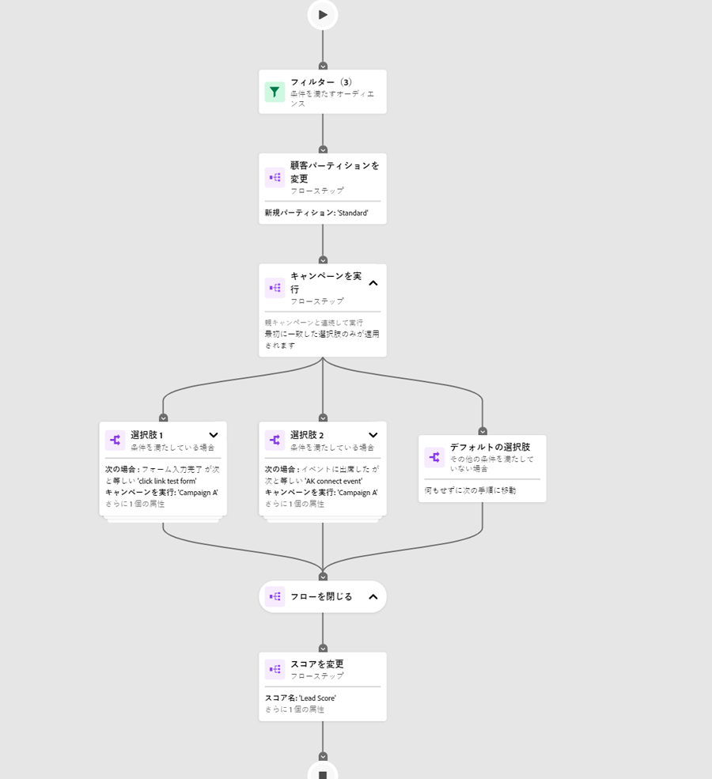
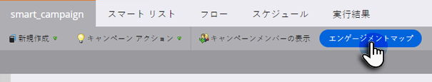
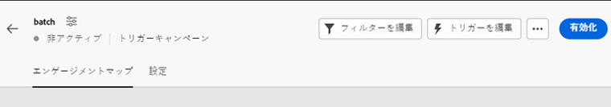

# エンゲージメントマップの概要 {#engagement-map-overview}

エンゲージメントマップでは、スマートキャンペーンを直感的に視覚化できます。 現在の機能を損なうことなく、既存のすべての Marketo Engage スマートキャンペーンとの完全な下位互換性を提供します。

>[!NOTE]
>
>エンゲージメントマップは現在、スマートキャンペーンで利用できます。 プログラムでは使用できません。

## エンゲージメントマップへのアクセス {#accessing-engagement-map}

既存のキャンペーンに移動し、「**エンゲージメントマップ**」ボタンをクリックします。

エンゲージメントマップには、[&#x200B; エンゲージメントマップ &#x200B;](/help/marketo/product-docs/core-marketo-concepts/engagement-map/engagement-map-tab.md){target="_blank"}と[設定](/help/marketo/product-docs/core-marketo-concepts/engagement-map/settings-tab.md){target="_blank"}の2つのタブがあります。

## カードの説明 {#card-descriptions}

**トリガー**:トリガーを含むキャンペーンでは、マップに「トリガーの概要」カードが表示されます。 これをクリックすると、各トリガーのカードと、追加情報を含むスライドアウトパネルが表示されます。

**フィルター**: フィルターを含むキャンペーンでは、マップにフィルターの概要カードが含まれています。 クリックすると、各フィルターに関する追加情報を含むスライドアウトパネルが表示されます。

**フローステップ**：各キャンペーンには、各フローステップのカードが含まれます。 これらをクリックすると、追加情報を含むスライドアウトパネルが表示されます。

**選択肢**: フローステップに1つ以上の選択肢が含まれる場合、フローカードをクリックすると、各選択肢のカードと、追加情報を含むスライドアウトパネルが表示されます。

## ネストされたキャンペーン {#nested-campaigns}

* キャンペーンに「キャンペーンをリクエスト」または「キャンペーンを実行」のフローステップが含まれている場合、フローカードをクリックすると、呼び出されるキャンペーンの詳細と、追加情報を含むスライドアウトパネルが表示されます。

* キャンペーンに「キャンペーンをリクエスト」または「キャンペーンを実行」のフローステップと選択肢が含まれている場合、フローカードをクリックすると、各選択肢のカードと、選択肢に関する詳細情報を含むスライドアウトパネルが表示されます。 各選択肢カードをクリックすると、呼び出されるキャンペーンの詳細と、詳細が表示されるスライドアウトパネルが表示されます。

* さらに、ネストされたキャンペーンにリクエストまたは「キャンペーンを実行」フローステップが含まれる場合は、フローカードをクリックすると、キャンペーンの詳細が表示されます。 同じことは、フローステップに選択肢が含まれる場合にも当てはまります。

## 上部ナビゲーション {#top-navigation}

上部のナビゲーションには、以下の機能が含まれます。

* キャンペーン名と「キャンペーンを編集」モーダルへのアクセス権は、ここでキャンペーン名と説明を編集できます。

* キャンペーンステータスおよびキャンペーンのタイプは、以下のキャンペーン名に反映されます

* トリガーキャンペーンの有効化／無効化ボタン

* スマートリストを編集 – フィルターやトリガーを追加または編集できる新しいタブで、スマートリストのインターフェイスに移動します

* フローを編集 – フローステップを追加または編集できる新しいタブで、フローインターフェイスに移動します

* 書き出し – キャンペーンビジュアライゼーションの画像をダウンロードします。 ダウンロードされたバージョンは、展開したブランチを反映します

* キャンペーンメンバーを表示 - これにより、キャンペーンメンバーの詳細を含む新しいタブが開かれます。

>[!NOTE]
>
>開いている「スマートリスト」タブと「フロー」タブで行った変更は、更新時に「エンゲージメントマップ」タブに反映されます。 自動的には更新されません。 自動保存された更新と編集は、「エンゲージメントマップ」タブの更新時に反映されます。

## よくある質問 {#faq}

**エンゲージメントマップのすべてのキャンペーンを再構築する必要がありますか？**

いいえ、できません。 エンゲージメントマップには完全な後方互換性があります。 ボタンをクリックするだけで、ビジュアルエンゲージメントマップのインターフェイスで既存のキャンペーンをそれぞれ確認できます。

**Marketo Engageでエンゲージメントマップを使用すると、フォルダー構造にアクセスできなくなり、スマートキャンペーンの作成方法を再学習する必要がありますか？**

いいえ、できません。 エンゲージメントマップは、両方の長所を提供し、キャンペーンの現在の構築方法を補完するものです。 Marketo Engageの強力な機能セットが、明確なビジュアルによって補完されます。

**エンゲージメントマップは有料アドオンですか？**

いいえ、できません。 すべてのサブスクリプションの既存および新規のMarketo Engage ユーザーは、この補完機能にアクセスできます。

**Marketo Engage管理者として、エンゲージメントマップのオン/オフを切り替える責任がありますか？**

いいえ、できません。 エンゲージメントマップは、インスタンス内のすべてのユーザーが利用できます。 特定のユーザーやワークスペースなどに対してオンまたはオフにすることはできません。

**他のビジュアルビルダーとの違いは何ですか？**

エンゲージメントマップには、3つの重要な要素があります。

* 柔軟性：相互に関連付けられ、連続性のあるキャンペーンを視覚化して簡単に管理、検証できます。

* 機能：すべてのビジュアルは標準装備で、使いやすくなっています。ネストされた構造により、深く探求し、全体像を確認できます。

* パワー：Marketo Engageの既存の洗練されたデザインは、すべてビジュアル形式で維持できます。

>[!MORELIKETHIS]
>
>* [&#x200B; エンゲージメントマップのタブ &#x200B;](/help/marketo/product-docs/core-marketo-concepts/engagement-map/engagement-map-tab.md){target="_blank"}
>* [「設定」タブ](/help/marketo/product-docs/core-marketo-concepts/engagement-map/settings-tab.md){target="_blank"}
