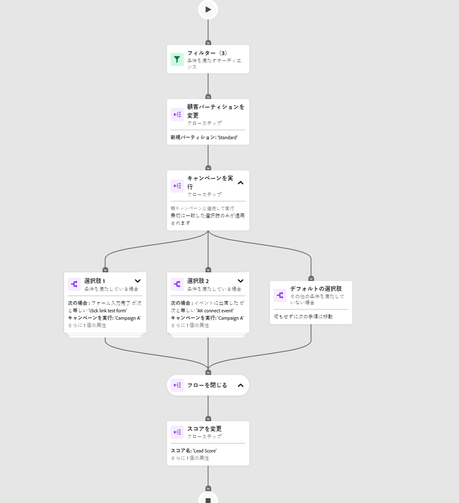

# エンゲージメントマップの概要 {#engagement-map-overview}

エンゲージメントマップを使用すると、スマートキャンペーンを直感的に視覚化できます。 現在の機能を損なうことなく、既存のすべての Marketo Engage スマートキャンペーンとの完全な下位互換性を提供します。

>[!NOTE]
>
>エンゲージメントマップは、現在、スマートキャンペーンで使用できます。 プログラムでは使用できません。

## エンゲージメントマップへのアクセス {#accessing-engagement-map}

既存のキャンペーンに移動し、「**エンゲージメントマップ**」ボタンをクリックします。

エンゲージメントマップには、「エンゲージメントマップ [ および ](/help/marketo/product-docs/core-marketo-concepts/engagement-map/engagement-map-tab.md){target="_blank"} 設定 [ の 2 つのタブがあ ](/help/marketo/product-docs/core-marketo-concepts/engagement-map/settings-tab.md){target="_blank"} ます。

## カードの説明 {#card-descriptions}

**トリガー**:トリガーを含むキャンペーンでは、マップに「トリガーの概要」カードが表示されます。 これをクリックすると、各トリガーのカードと、追加情報を含むスライドアウトパネルが表示されます。

**フィルター**：フィルターを含むキャンペーンの場合、マップにはフィルターの概要カードが含まれます。 クリックすると、各フィルターの追加情報を含むスライドアウトパネルが表示されます。

**フローステップ**：各キャンペーンには、各フローステップのカードが含まれます。 これらをクリックすると、追加情報を含むスライドアウトパネルが表示されます。

**選択肢**：フローステップに 1 つ以上の選択肢が含まれる場合、フローカードをクリックすると、各選択肢のカードと、追加情報を含むスライドアウトパネルが表示されます。

## ネストされたキャンペーン {#nested-campaigns}

* キャンペーンに「リクエスト」または「キャンペーンを実行」フローステップが含まれる場合、フローカードをクリックすると、呼び出されるキャンペーンの詳細と、追加情報を含むスライドアウトパネルが表示されます。

* キャンペーンに選択肢を含む「リクエスト」または「キャンペーンの実行」フローステップが含まれている場合、フローカードをクリックすると、各選択肢のカードと、選択肢に関する詳細情報を含むスライドアウトパネルが表示されます。 各選択カードをクリックすると、呼び出されるキャンペーンの詳細と、詳細情報を含むスライドアウトパネルが表示されます。

* さらに、ネストされたキャンペーンにリクエストまたは「キャンペーンを実行」フローステップが含まれる場合は、フローカードをクリックすると、キャンペーンの詳細が表示されます。同じことは、フローステップに選択肢が含まれる場合にも当てはまります。

## 上部ナビゲーション {#top-navigation}

上部のナビゲーションには、以下の機能が含まれます。

* キャンペーン名と「キャンペーンを編集」モーダルへのアクセス。ここでキャンペーンの名前と説明を編集できます。

* キャンペーンステータスおよびキャンペーンのタイプは、以下のキャンペーン名に反映されます

* トリガーキャンペーンの有効化／無効化ボタン

* スマートリストを編集 – 新しいタブでスマートリストインターフェイスに移動します。このタブで、フィルターやトリガーを追加または編集できます

* フローを編集 – 新しいタブでフローインターフェイスに移動し、フローステップを追加または編集できます

* エクスポート – キャンペーンのビジュアライゼーションの画像をダウンロードします。 ダウンロードしたバージョンは、展開したすべてのブランチを反映しています

* キャンペーンメンバーを表示 - これにより、キャンペーンメンバーの詳細を含む新しいタブが開かれます。

>[!NOTE]
>
>開いているスマートリストおよび「フロー」タブで加えた変更は、更新時に「エンゲージメントマップ」タブに反映されます。 自動的には更新されません。自動保存された更新と編集は、「エンゲージメントマップ」タブの更新時に反映されます。

## よくある質問 {#faq}

**エンゲージメントマップですべてのキャンペーンを再構築する必要がありますか？**

いいえ、できません。 エンゲージメントマップには、完全な後方互換性があります。 ボタンをクリックするだけで、既存の各キャンペーンを視覚的なエンゲージメントマップインターフェイスで確認できます。

**エンゲージメントマップがMarketo Engageにあるということは、フォルダー構造にアクセスできなくなるということですか？また、スマートキャンペーンの作成方法を学び直す必要がありますか？**

いいえ、できません。 エンゲージメントマップの優れた点は、両方の長所を活かせるということです。現在のキャンペーンの作成方法と相補しているからです。 すべてのユーザーは、Marketo Engageの強力な機能セットを引き続き利用でき、明確なビジュアルで補完されるようになりました。

**Engagement Map は有料アドオンですか？**

いいえ、できません。 すべてのサブスクリプションの既存および新規のMarketo Engage ユーザーは、この補完的な機能にアクセスできます。

**Marketo Engage管理者は、Engagement Map のオン/オフを切り替える責任がありますか？**

いいえ、できません。 エンゲージメントマップは、該当するインスタンスのすべてのユーザーが使用できます。 特定のユーザーやワークスペースなどに対してオン/オフを切り替えることはできません。

**他のビジュアルビルダーとの違いは**

エンゲージメントマップには、主に次の 3 つのポイントがあります。

* 柔軟性：ビジュアライゼーションを使用して、相互に接続された、または深くネストされたキャンペーンを簡単に管理および検証します。

* 機能：すべてのビジュアルが標準で用意されているので、使いやすくなっています。ネストされた構造により、詳細に検討して全体像を把握できます。

* パワー：Marketo Engageの既存の高度な機能をすべて視覚的な形式で維持できます。

>[!MORELIKETHIS]
>
>* [ エンゲージメントマップタブ ](/help/marketo/product-docs/core-marketo-concepts/engagement-map/engagement-map-tab.md){target="_blank"}
>* [「設定」タブ](/help/marketo/product-docs/core-marketo-concepts/engagement-map/settings-tab.md){target="_blank"}
