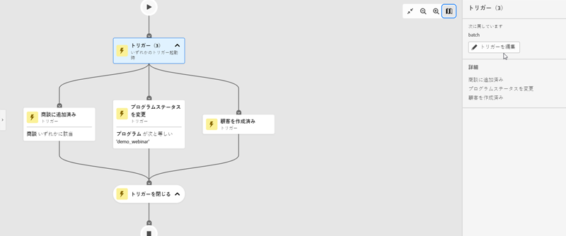
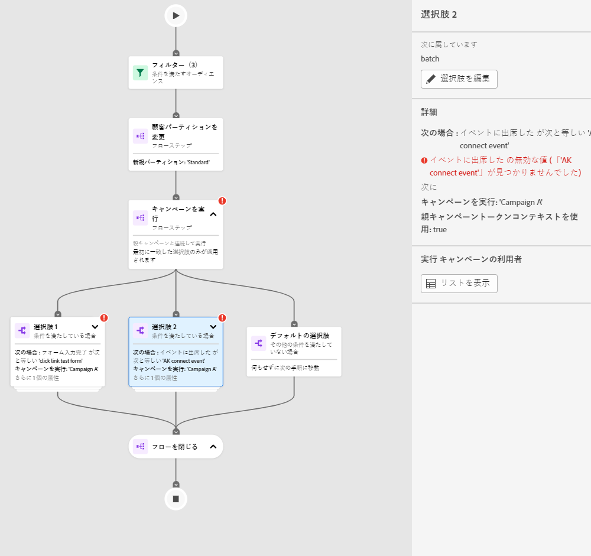
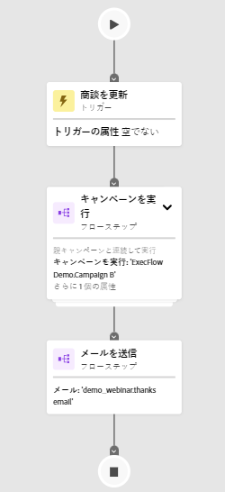
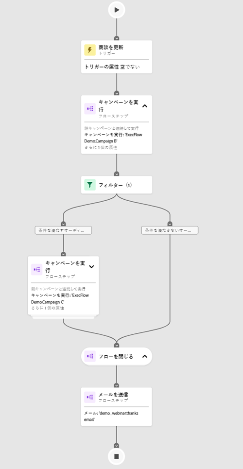
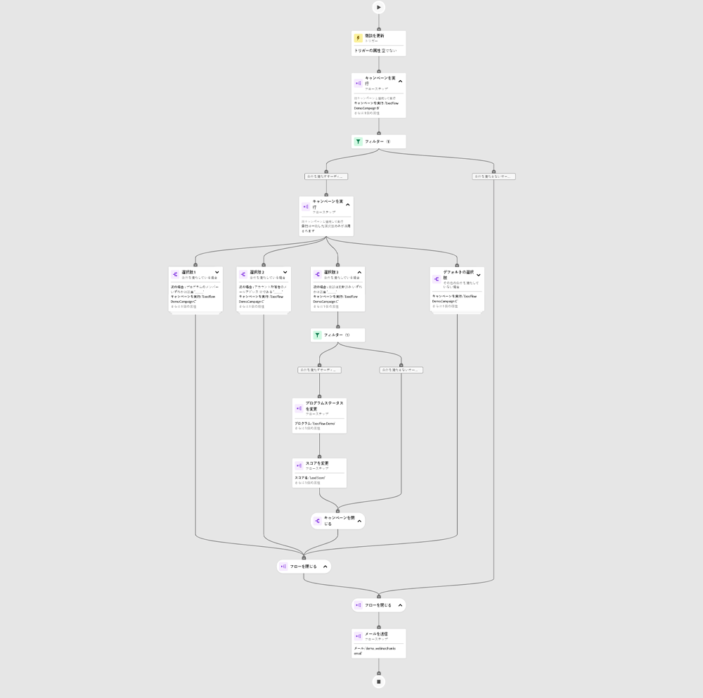
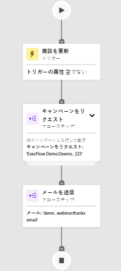
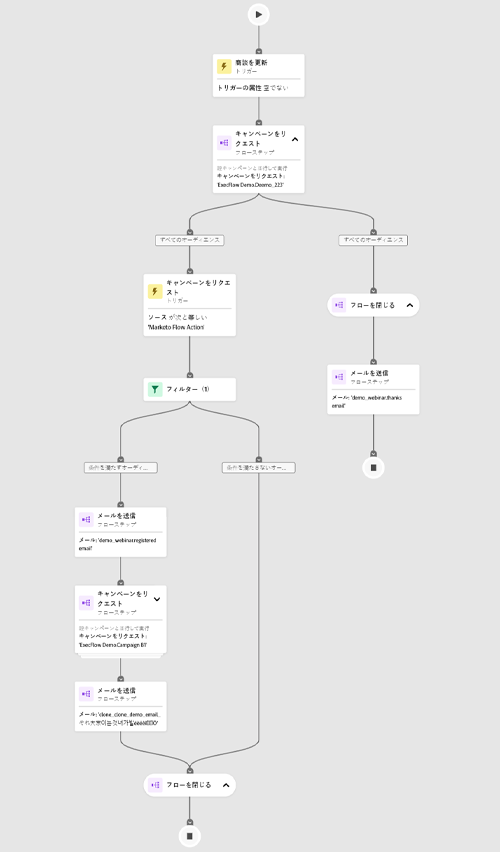
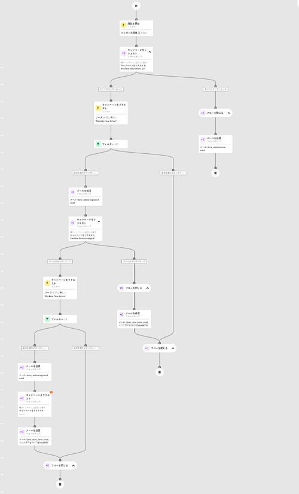
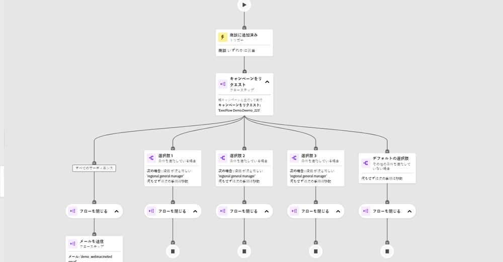
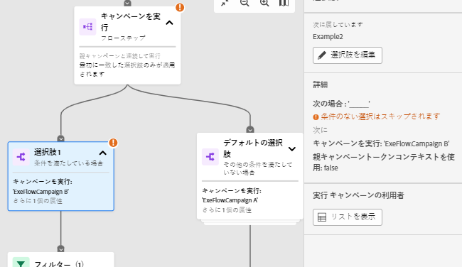

# 「エンゲージメントマップ」タブ {#engagement-map-tab}

エンゲージメントマップは、一連のトリガー、フィルターおよびフローカードで表されます。 各カードをクリックすると、追加情報が表示されます。

トリガーの概要：このカードには、キャンペーンのトリガーの数が表示されます。アイコンをクリックすると、各トリガーのカードと、次の情報を含むスライドアウトパネルが表示されます。

* トリガーが属するキャンペーン
* トリガー名のリスト
* トリガーを編集

  

トリガーの詳細：トリガー名が表示されます。 クリックすると、次の情報を含むスライドアウトパネルが表示されます。

* トリガーが属するキャンペーン
* トリガーに関連付けられた制約のリスト
* トリガーを編集

フィルター：このカードをクリックすると、次の情報を含むスライドアウトパネルが表示されます。

* フィルターが属するキャンペーン
* フィルターの条件を満たす人物の推定数
* フィルターとその各制約のリスト
* フィルターの編集

  

フローステップ：選択肢が含まれるフローステップの場合、このカードにはフローステップ名が表示されます。 クリックすると、次の情報を含むスライドアウトパネルが表示されます。

* フローステップが属するキャンペーン
* フローステップに関連付けられている選択条件のリスト
* フローステップを編集

フローステップ：フローステップに選択肢が含まれていない _い_ 場合、このカードにはフローステップに関連付けられている属性が表示されます。 クリックすると、次の情報を含むスライドアウトパネルが表示されます。

* フローステップが属するキャンペーン
* フローステップに関連付けられている属性のリスト
* フローステップを編集

  

## 「キャンペーンを実行」および「キャンペーンをリクエスト」のフローステップ {#flow-step-for-execute-and-request-campaigns}

* キャンペーンの実行またはリクエストのフローステップに選択肢が含まれていない場合、カードにはキャンペーンの名前が表示されます。 カードをクリックすると、次の情報を含むスライドアウトパネルが表示されます。

   * フローステップが属するキャンペーン
   * フローステップを編集
   * フローステップに関連付けられている属性のリスト
   * 「リストを表示」ボタン（特定のキャンペーンをリクエスト／実行を使用するキャンペーンのリストを開きます）

>[!NOTE]
>
>プライマリキャンペーンからフローステップを編集できます。 ネストされたキャンペーンを編集するには、スライドアウトパネルのリンクを使用してキャンペーンに移動する必要があります。

* 実行またはリクエスト キャンペーンフローステップに選択肢が含まれる場合、カードをクリックすると、次の情報を含むスライドアウトパネルが表示されます。

   * フローステップが属するキャンペーン
   * フローステップに関連付けられている選択条件のリスト
   * フローステップを編集

* キャンペーンを実行またはリクエストに選択肢が含まれている場合、フローカードをクリックすると、個々のカードのすべての選択肢が表示されます。_選択_ カードをクリックすると、特定の選択に関連付けられたキャンペーンが展開され、次の情報を含むスライドアウトパネルが表示されます。

   * 選択肢が属するキャンペーン
   * 選択肢を編集
   * フローステップに関連付けられている選択条件のリスト
   * 表示リスト：特定のリクエスト/実行キャンペーンを使用するキャンペーンのリストが開きます

  

## ネストされた「キャンペーンを実行」の視覚化 {#visualizing-a-nested-execute-campaign}

親キャンペーンと直列に実行されたキャンペーンを実行します。 実行可能なキャンペーンの対象となるユーザーは、キャンペーンからのすべてのフロー手順を完了してプライマリキャンペーンに戻り、このキャンペーンのフロー手順を続行できます。

以下は、キャンペーンのフロー実行手順を含む、スマートキャンペーン「キャンペーン A」の例です。 「キャンペーン A」は主要なキャンペーンと考えてください。

1. 「キャンペーンを実行」フローカードをクリックすると、展開して「キャンペーン B」の詳細が表示されます。
1. 「キャンペーン B」には、オーディエンスを 2 つのグループ（認定済みと未認定）に分割するフィルターが含まれています。
1. 選定されたオーディエンスは、「キャンペーン B」に関連付けられたフローステップを実行します。
1. すべてのオーディエンス（選定および未選定）は「キャンペーン A」に戻り、次のフローステップに進みます。

   

「キャンペーン B」の「キャンペーンフローを実行」ステップをクリックできます。このステップは展開され、各選択に関連付けられた選択カードとキャンペーンが表示されます。

## 「キャンペーンをリクエスト」の視覚化 {#visualizing-request-campaign}

リクエストキャンペーンは、親キャンペーンと並行して実行されます。 リクエストキャンペーンに適合するユーザーは、キャンペーンのすべてのフロー手順を完了してから、キャンペーンを終了します。 同時に、同じユーザーのグループがプライマリキャンペーンからフロー手順を実行します。

次に、リクエストキャンペーンフローステップを含む、スマートキャンペーン「キャンペーン A」の例を示します。 「キャンペーン A」は主要なキャンペーンと考えてください。

1. リクエストキャンペーンフローカードをクリックすると展開し、「キャンペーン B」の詳細が表示されます
1. 「キャンペーン B」には、オーディエンスを 2 つのグループ（認定済みと未認定）に分割するフィルターが含まれています。
1. 選定されたオーディエンスは、「キャンペーン B」に関連付けられたフローステップを実行します。
1. 同時に、すべてのオーディエンスが「キャンペーン A」の次のフローステップに移動します。

   

フロー手順に別のリクエストキャンペーンが含まれている場合は、フローカードをクリックしてキャンペーンの詳細を表示し、ネストされたキャンペーンをさらに詳しく調べることができます。

選択肢を含んだリクエストキャンペーンの例を次に示します。

## エラー処理 {#error-handling}

スマートリストおよびフローステップのエラーは、カードの赤いアイコンでハイライト表示されます。 さらに、対応するエラーメッセージがスライドアウトパネルに反映される。

スマートリストおよびフローステップの警告は、カードのオレンジ色のアイコンでハイライト表示されます。 さらに、対応する警告メッセージがスライドアウトパネルに反映される。

以下に、選択カードの警告の例を示します。これは、Campaign フローの実行ステップカード、スライドアウトパネルおよびデフォルト選択カードに表示されます。

>[!NOTE]
>
>警告は、確認が必要な推奨事項ですが、スマートキャンペーンのエラーを示すものではありません。

**フィルターカードのエラーには、次のものが含まれます。**

* 適格なオーディエンスが表示されない原因となるスマートリストのエラー

* フィルターロジックのエラー

* 1 つ以上のフィルターの制約（または制約の欠如）のエラー

  

>[!NOTE]
>
>ネストされたキャンペーン内のエラーは、ネストされたキャンペーンを展開するためにクリックするまで表示されません。
