# 「エンゲージメントマップ」タブ {#engagement-map-tab}

エンゲージメントマップは、一連のトリガー、フィルター、フローカードで表されます。 各カードをクリックすると、追加の情報が表示されます。

トリガーの概要：このカードには、キャンペーンのトリガーの数が表示されます。 これをクリックすると、各トリガーのカードと、次の情報を含むスライドアウトパネルが表示されます。

* トリガーが属するキャンペーン
* トリガー名のリスト
* トリガーを編集

  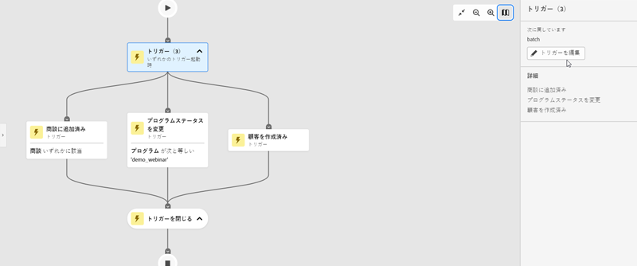

トリガーの詳細：このカードにはトリガー名が表示されます。 これをクリックすると、次の情報を含むスライドアウトパネルが表示されます。

* トリガーが属するキャンペーン
* トリガーに関連付けられた制約のリスト
* トリガーを編集

フィルター：このカードをクリックすると、次の情報を含むスライドアウトパネルが表示されます。

* フィルターが属するキャンペーン
* フィルターの条件を満たす人物の推定数
* フィルターとその各制約のリスト
* フィルターの編集

  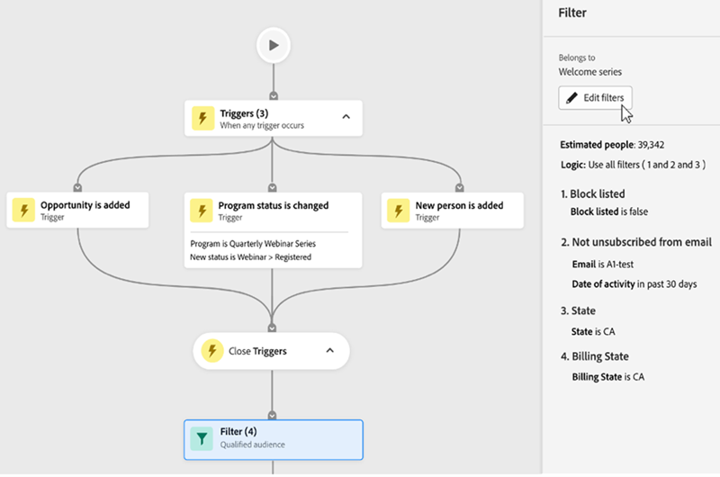

フローステップ：フローステップに選択肢が含まれる場合、このカードにはフローステップの名前が表示されます。 これをクリックすると、次の情報を含むスライドアウトパネルが表示されます。

* フローステップが属するキャンペーン
* フローステップに関連付けられている選択条件のリスト
* フローステップを編集

フローステップ：フローステップに選択肢が&#x200B;_ない_&#x200B;場合、このカードにはフローステップに関連付けられた属性が表示されます。 これをクリックすると、次の情報を含むスライドアウトパネルが表示されます。

* フローステップが属するキャンペーン
* フローステップに関連付けられている属性のリスト
* フローステップを編集

  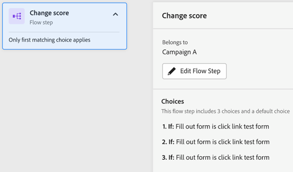

## 「キャンペーンを実行」および「キャンペーンをリクエスト」のフローステップ {#flow-step-for-execute-and-request-campaigns}

* 「キャンペーンのフローを実行」または「キャンペーンのフローを要求」ステップに選択肢が含まれていない場合、カードにキャンペーンの名前が表示されます。 カードをクリックすると、次の情報を含むスライドアウトパネルが表示されます。

   * フローステップが属するキャンペーン
   * フローステップを編集
   * フローステップに関連付けられている属性のリスト
   * 「リストを表示」ボタン。特定の「要求」または「キャンペーンを実行」を使用するキャンペーンのリストが開きます。

>[!NOTE]
>
>プライマリキャンペーンからフローステップを編集できます。 ネストされたキャンペーンを編集するには、スライドアウトパネルのリンクを使用してキャンペーンに移動する必要があります。

* 「キャンペーンのフローを実行」または「キャンペーンのフローを要求」ステップに選択肢が含まれる場合、カードをクリックすると、次の情報を含むスライドアウトパネルが表示されます。

   * フローステップが属するキャンペーン
   * フローステップに関連付けられている選択条件のリスト
   * フローステップを編集

* キャンペーンを実行またはリクエストに選択肢が含まれている場合、フローカードをクリックすると、個々のカードのすべての選択肢が表示されます。 _choice_ カードをクリックすると、特定の選択肢に関連付けられたキャンペーンが展開され、次の情報を含むスライドアウトパネルが表示されます。

   * 選択肢が属するキャンペーン
   * 選択肢を編集
   * フローステップに関連付けられている選択条件のリスト
   * リストを表示：特定の「要求」または「キャンペーンを実行」を使用するキャンペーンのリストを開きます

  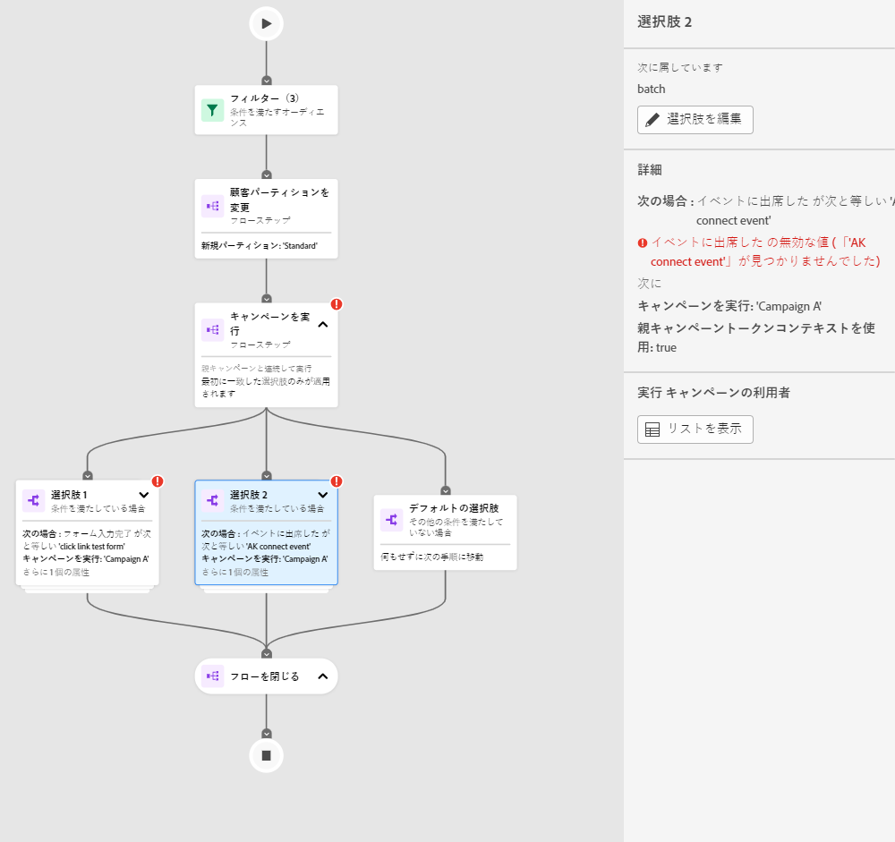

## ネストされた「キャンペーンを実行」の視覚化 {#visualizing-a-nested-execute-campaign}

親キャンペーンと同時にキャンペーンを実行。 実行キャンペーンの対象となるユーザーは、キャンペーンのすべてのフローステップを完了し、プライマリキャンペーンに戻って、このキャンペーンのフローステップを続行します。

次に、キャンペーンの実行フローステップを含むスマートキャンペーン「キャンペーン A」の例を示します。 「キャンペーン A」を主要なキャンペーンと考えてください。

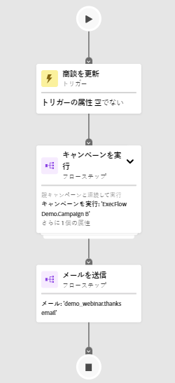

1. キャンペーンフローの実行カードをクリックすると、「キャンペーン B」の詳細が表示されます。
1. 「キャンペーン B」には、オーディエンスを適格と非適格の2つのグループに分割するフィルターが含まれています。
1. 適格オーディエンスは、「キャンペーン B」に関連するフローステップを通過します。
1. すべてのオーディエンス（適格と非適格）は「キャンペーン A」に戻り、次のフローステップに進みます。

   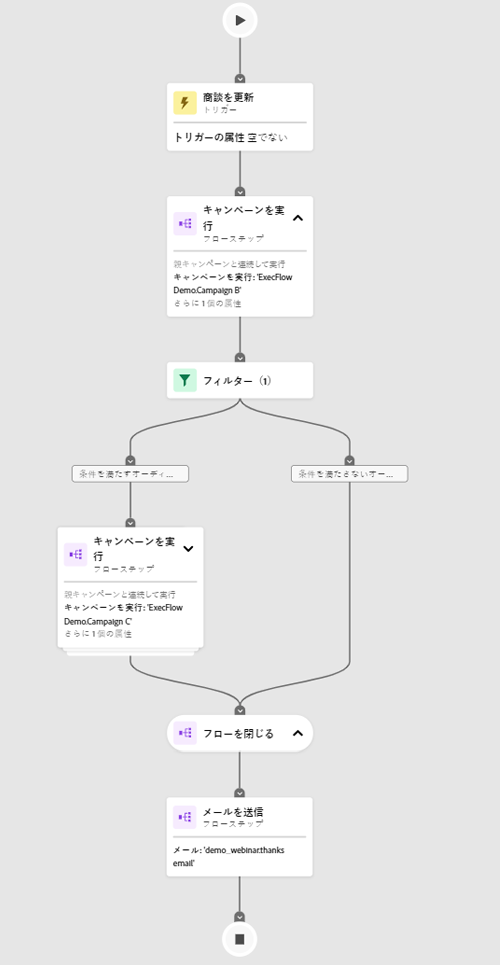

「キャンペーン B」の「キャンペーン フローを実行」ステップをクリックすると、展開され、各選択肢に関連付けられた選択肢カードとキャンペーンが表示されます。

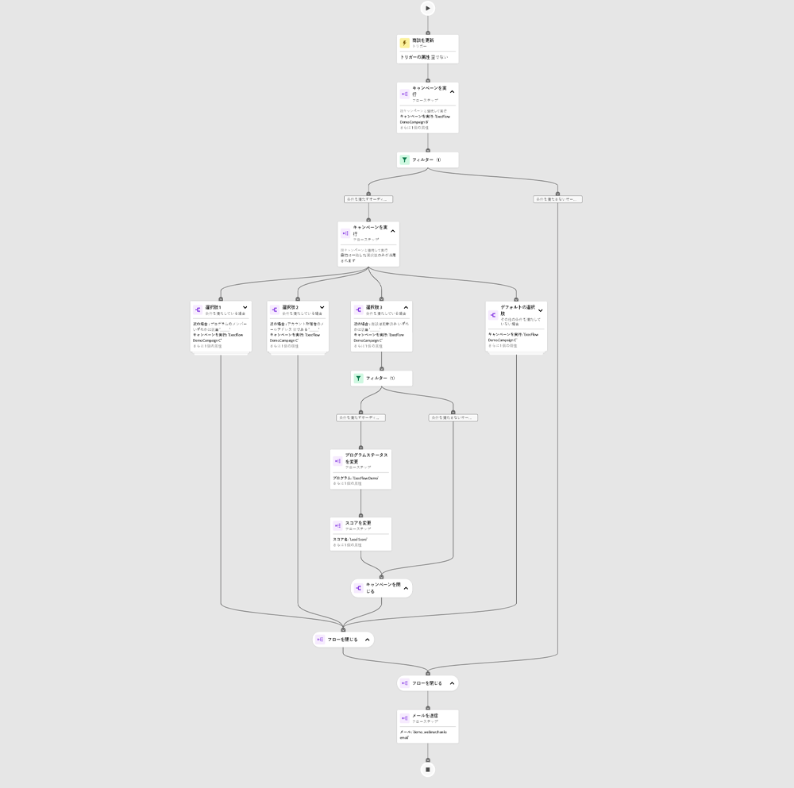

## 「キャンペーンをリクエスト」の視覚化 {#visualizing-request-campaign}

リクエストキャンペーンは、親キャンペーンと並行して実行されます。 リクエストキャンペーンの対象となるユーザーは、キャンペーンのすべてのフローステップを完了してからキャンペーンを終了します。 同時に、同じユーザーのセットがプライマリキャンペーンのフローステップを通過します。

次に、リクエストキャンペーンフローステップを含むスマートキャンペーン「キャンペーン A」の例を示します。 「キャンペーン A」を主要なキャンペーンと考えてください。

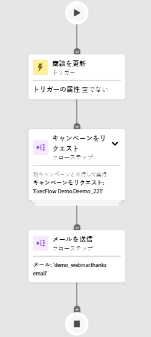

1. リクエストキャンペーンフローカードをクリックすると、「キャンペーン B」の詳細が表示されます
1. 「キャンペーン B」には、オーディエンスを適格と非適格の2つのグループに分割するフィルターが含まれています。
1. 適格オーディエンスは、「キャンペーン B」に関連するフローステップを通過します。
1. 同時に、すべてのオーディエンスは「キャンペーン A」の次のフローステップに移動します。

   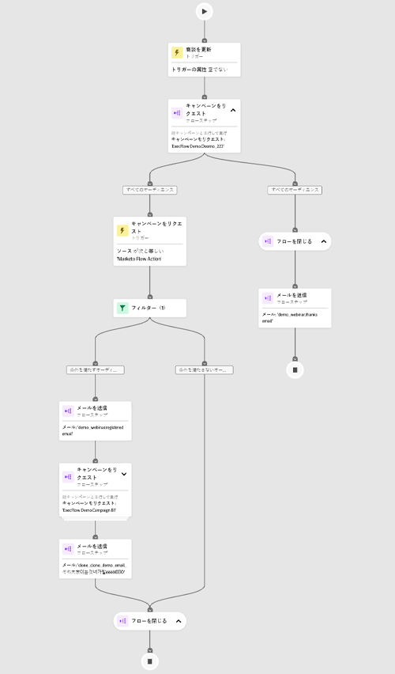

フローカードをクリックしてキャンペーンの詳細を表示し、フローステップに別のリクエストキャンペーンが含まれている場合は、ネストされたキャンペーンを詳しく調べることができます。

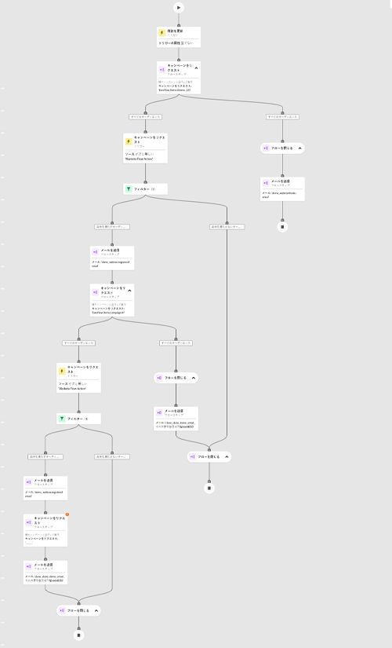

次に、選択肢を含むリクエストキャンペーンの例を示します。

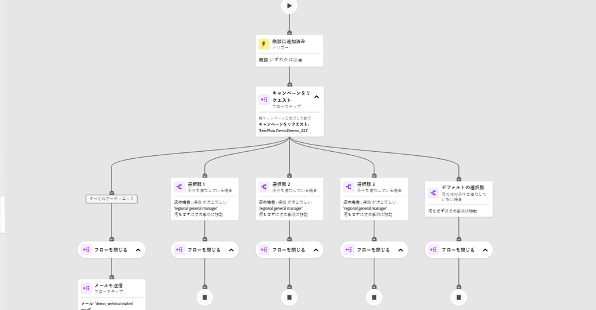

## エラー処理 {#error-handling}

スマートリストとフローステップのエラーは、カード内の赤いアイコンで強調表示されます。 さらに、対応するエラーメッセージがスライドアウトパネルに反映されます。

スマートリストとフローステップの警告は、カード内のオレンジ色のアイコンで強調表示されます。 さらに、対応する警告メッセージがスライドアウトパネルに反映されます。

以下は、キャンペーンフローの実行ステップカード、スライドアウトパネル、デフォルトの選択カードに表示される選択カードの警告の例です。

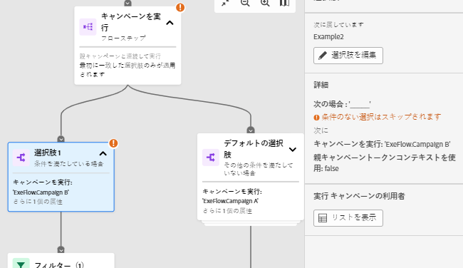

>[!NOTE]
>
>警告は確認するための推奨事項ですが、スマートキャンペーンのエラーを示すものではありません。

**フィルターカードのエラーには次のものが含まれます：**

* スマートリストでエラーが発生し、適格なオーディエンスが表示されない

* フィルターロジックのエラー

* 1つ以上のフィルター内の制約のエラー（またはその欠如）

  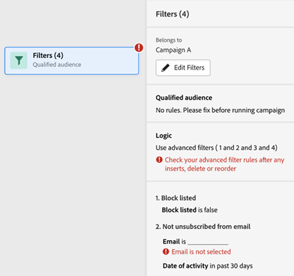

>[!NOTE]
>
>ネストされたキャンペーン内のエラーは、クリックしてネストされたキャンペーンを展開するまで表示されません。
