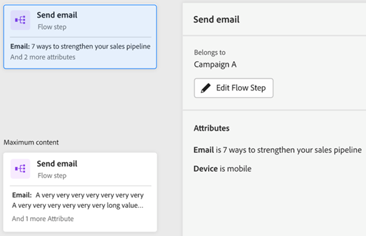
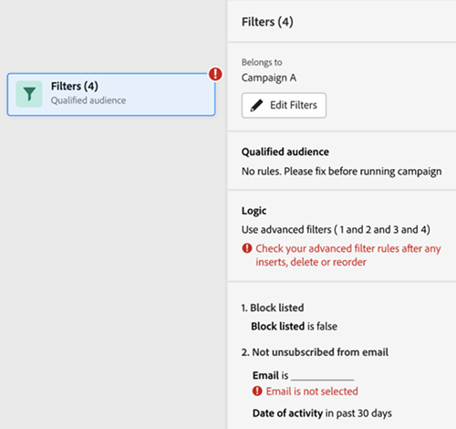

# 「エンゲージメントマップ」タブ {#engagement-map-tab}

エンゲージメントマップは、一連のトリガー、フィルター、フローカードを通じて表されます。 各カードをクリックすると、追加情報が表示されます。

トリガーの概要：このカードには、キャンペーンのトリガー数が表示されます。 クリックすると、各トリガーのカードと、次の情報を含むスライドアウトパネルが表示されます。

* トリガーが属するキャンペーン
* トリガー名のリスト
* 「トリガーを編集」ボタン

  

トリガーの詳細：このカードにはトリガー名が表示されます。 クリックすると、次の情報を含むスライドアウトパネルが表示されます。

* トリガーが属するキャンペーン
* トリガー
* 「トリガーを編集」ボタン

  

フィルター：このカードをクリックすると、次の情報を含むスライドアウトパネルが表示されます。

* トリガーが属するキャンペーン
* フィルターの条件を満たす推定人数
* フィルターのリストとそれぞれの制約
* 「フィルターを編集」ボタン

  

フローステップ：フローステップに選択肢が含まれる場合、このカードにはフローステップの名前が表示されます。 クリックすると、次の情報を含むスライドアウトパネルが表示されます。

* フローステップが属するキャンペーン
* フローステップに関連付けられた選択条件のリスト
* 「フローを編集」ボタン

  

フローステップ：フローステップが _not_ 任意の選択肢を含めると、このカードにはフローステップに関連する属性が表示されます。 クリックすると、次の情報を含むスライドアウトパネルが表示されます。

* フローステップが属するキャンペーン
* フローステップに関連付けられた属性のリスト
* 「フローを編集」ボタン

  

## キャンペーンの実行およびリクエストのフローステップ {#flow-step-for-execute-and-request-campaigns}

* キャンペーンの実行またはリクエストのフローステップに選択肢が含まれていない場合、カードにキャンペーンの名前が表示されます。 カードをクリックすると、次の情報を含むスライドアウトパネルが表示されます。

   * フローステップが属するキャンペーン
   * 「フローを編集」ボタン
   * フローステップに関連付けられた属性のリスト
   * 「リストを表示」ボタン：特定のリクエスト/実行キャンペーンを使用するキャンペーンのリストを開きます。

>[!NOTE]
>
>プライマリキャンペーンからフローステップを編集できます。 ネストされたキャンペーンを編集するには、スライドアウトパネルのリンクからキャンペーンに移動する必要があります。

* キャンペーンの実行またはリクエストのフローステップに選択肢が含まれている場合、カードにキャンペーンの名前が表示されます。 カードをクリックすると、次の情報を含むスライドアウトパネルが表示されます。

   * フローステップが属するキャンペーン
   * フローステップに関連付けられた選択条件のリスト
   * 「フローを編集」ボタン

  

  

* 「キャンペーンの実行」または「キャンペーンのリクエスト」に選択肢が含まれている場合、フローカードをクリックすると展開し、個々のカード内のすべての選択肢が表示されます。 選択カードをクリックすると、特定の選択に関連付けられたキャンペーンが展開され、次の情報を含むスライドアウトパネルが表示されます。

   * 選択肢が属するキャンペーン
   * 「選択を編集」ボタン
   * フローステップに関連付けられた選択条件のリスト
   * 「リストを表示」ボタン：特定のリクエスト/実行キャンペーンを使用するキャンペーンのリストを開きます。

  

## ネストされた実行キャンペーンの視覚化 {#visualizing-a-nested-execute-campaign}

ここで編集を取り戻しました —

実行可能なキャンペーンの対象となる親キャンペーン担当者と連続して実行されるキャンペーンは、キャンペーンからのすべてのフローステップを完了し、プライマリキャンペーンに戻って、このキャンペーンのフローステップを続行します。

スマートキャンペーン「キャンペーン A」の例を以下に示します。この例には、キャンペーンの実行フローステップが含まれています。 「キャンペーン A」をプライマリキャンペーンと考えてください。

1. 「キャンペーンの実行」フローカードをクリックすると、展開して「キャンペーン B」の詳細が表示されます。
1. 「キャンペーン B」には、対象オーディエンスと対象外オーディエンスに分岐するフィルターが含まれます。
1. 対象オーディエンスは、「キャンペーン B」に関連付けられたフローステップを実行します。
1. すべてのオーディエンス（適合、非適合）が「キャンペーン A」に戻り、次のフローステップに進みます。

ここで編集を停止 —

「キャンペーン B」のキャンペーンの実行フローステップをクリックすると、展開されて、各選択肢に関連付けられた選択肢カードとキャンペーンが表示されます。

## リクエストキャンペーンの視覚化 {#visualizing-request-campaign}

リクエストキャンペーンは親キャンペーンと並行して実行されます。つまり、リクエストキャンペーンの対象となるリードが、キャンペーンからのすべてのフローステップを完了し、キャンペーンを終了します。 同時に、同じリードセットもプライマリキャンペーンのフローステップを進めます

次に、キャンペーンリクエストフローステップを含むスマートキャンペーン「キャンペーン A」の例を示します。 「キャンペーン A」をプライマリキャンペーンと考えることができます。

1. リクエストキャンペーンフローカードをクリックすると、展開して「キャンペーン B」の詳細が表示されます
1. キャンペーン B には、対象オーディエンスに分岐するフィルターが含まれます。
1. 対象オーディエンスは、「キャンペーン B」に関連付けられたフローステップを実行します
1. 同時に、すべてのオーディエンスが「キャンペーン A」の次のフローステップに進みます

   

フローステップのいずれかに別のリクエストキャンペーンが含まれている場合は、フローカードをクリックして、ネストされたキャンペーンの詳細を確認できます

次に、選択肢を含むリクエストキャンペーンの例を示します。

## エラー処理 {#error-handling}

スマートリストおよびフローステップのエラーは、カードのエラーアイコンで強調表示されます。 さらに、対応するエラーメッセージがスライドアウトパネルに反映されます。

次に、トリガーのエラーの例を示します。トリガーの概要カード、スライドアウトパネル、詳細トリガーカードに示されます。

フィルターカードのエラーには次が含まれる可能性があります

スマートリストにエラーがあり、選定されたオーディエンスが表示されません

フィルターロジックのエラー

1 つ以上のフィルターでの制約または制約の欠如のエラー

値（属性）を入力しない場合、エラーとしてフラグ付けされず、「フロー」タブと同様に機能し続けます。 したがって、既存のキャンペーンが中断されることはありません。 ただし、フローステップに属性が含まれていない場合は、警告として表示されます。

注意：ネストされたキャンペーン内のエラーは、ネストされたキャンペーンをクリックして展開するまで表示されません
