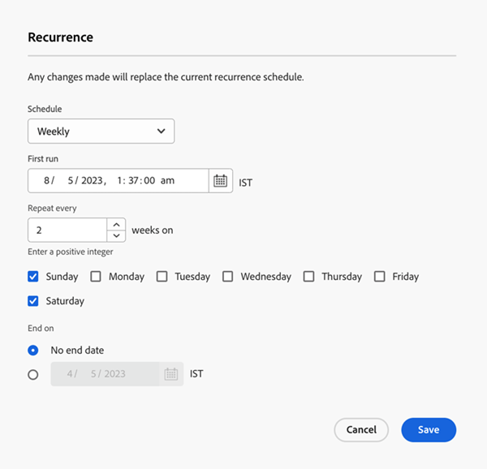
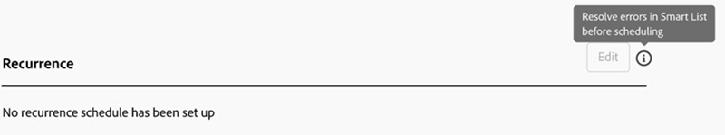

# 「設定」タブ {#settings-tab}

「設定」タブには、スマートキャンペーンの「スケジュール」タブと同じ権限セットとアクセス権を含む、すべてのキャンペーン設定が表示されます。

以下の 3 つのセクションが含まれます。

* **選定ルール**：スマートキャンペーンフローを通じて各顧客が実行できる回数を決定します。

* **個々の実行**：即座にまたは将来、単一の実行をスケジュールするために使用できます。

* **繰り返し**：毎日、毎週または毎月の繰り返しをスケジュールするために使用されます。

  

選定ルールは、すべてのキャンペーン（トリガーおよびバッチ）で使用でき、以下の設定が含まれます。

* 人物がキャンペーンに進む回数を決定できます
* 人物が通信制限を超えている場合、非オペレーショナルキャンペーンをブロックする機能
* 中止キャンペーンの人物制限を設定する機能

  

個々の実行は、キャンペーンを即座に実行したり、将来の 1 回限りの実行を設定したりするのに使用できます。

>[!TIP]
>
>一連のキャンペーンをスケジュールする場合は、繰り返しモーダルを使用する方が簡単です。

繰り返しモーダルには、毎日、毎週または毎月ベースで繰り返しのスケジュールを設定する機能が含まれています。 設定が完了すると、「設定」タブに次の3回の実行が表示されます。

「設定」タブには、スマートキャンペーンの概要も表示されます。 以下が含まれます。

* キャンペーンステータス
* 作成日
* 最終変更日
* スマートリストモード
* スマートリストステータス：
   * 影響を受けると推定される人物
   * メールからブロックされていると推定される人物
   * 待機中だと推定される人物

「設定」タブの権限セットおよびエラー：

既存のすべての権限セットは、「設定」タブで適用できます。 「編集」ボタンがグレー表示されている場合は、ヘルプアイコンをクリックして理由を確認します。

>[!NOTE]
>
>ヘルプアイコンをクリックした後、「追加の権限が必要」と表示された場合は、Adobe アカウントチーム（アカウントマネージャー）にお問い合わせください。

