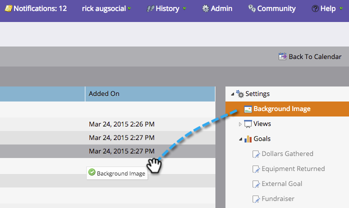

# プレゼンテーションへの背景画像の追加 {#add-a-background-image-to-a-presentation}

背景画像を選択して、プレゼンテーションをカスタマイズします。

>[!PREREQUISITES]
>
>[プレゼンテーションの作成](/help/marketo/product-docs/core-marketo-concepts/marketing-calendar/calendar-hd/create-a-presentation.md)

1. プレゼンテーションを右クリックし、「**設定を表示**」を選択します。

   >[!NOTE]
   >
   >プレゼンテーションをダブルクリックして、「設定」タブを表示することもできます。

   

1. 右のツリーから「**背景画像**」をキャンバスにドラッグ＆ドロップします。

   

1. 画像ライブラリから画像を選択します。

   >[!TIP]
   >
   >最適な外観を得るには、**1920 x 1080** または **1280 x 720** の画像を使用します。

   

1. 「**プレビュー**」をクリックして確認します。

   

   これで完了です。
