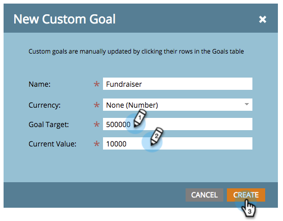

# カスタムゴールの作成 {#create-a-custom-goal}

ゴールとは、進行状況を追跡し、チームを動機付けるための機能です。 作成後は、手動で更新する必要があります。

プレゼンテーションと同様、ゴールも[ワークスペース](/help/marketo/product-docs/administration/workspaces-and-person-partitions/understanding-workspaces-and-person-partitions.md)に固有です。

1. **[!UICONTROL カレンダー]**&#x200B;に移動します。

   

1. 右下隅の「**[!UICONTROL プレゼンテーション]**」をクリックします。

   

1. 「**[!UICONTROL ゴール]**」タブを選択します。

   

1. 「**[!UICONTROL カスタムゴール]**」をキャンバスにドラッグ＆ドロップします。

   

1. ゴールの名前を入力します。 「**[!UICONTROL 通貨]**」を選択します。

   >[!NOTE]
   >
   >ゴールが金額値ではない場合は、「**[!UICONTROL なし]**」を選択できます。

   

1. **[!UICONTROL 目標ターゲット]**&#x200B;と&#x200B;**[!UICONTROL 現在の値]**&#x200B;の値を入力します（存在しない場合は、**0**&#x200B;と入力します）。 「**[!UICONTROL 作成]**」をクリックします。

   

   カスタム目標が作成されました。

   
