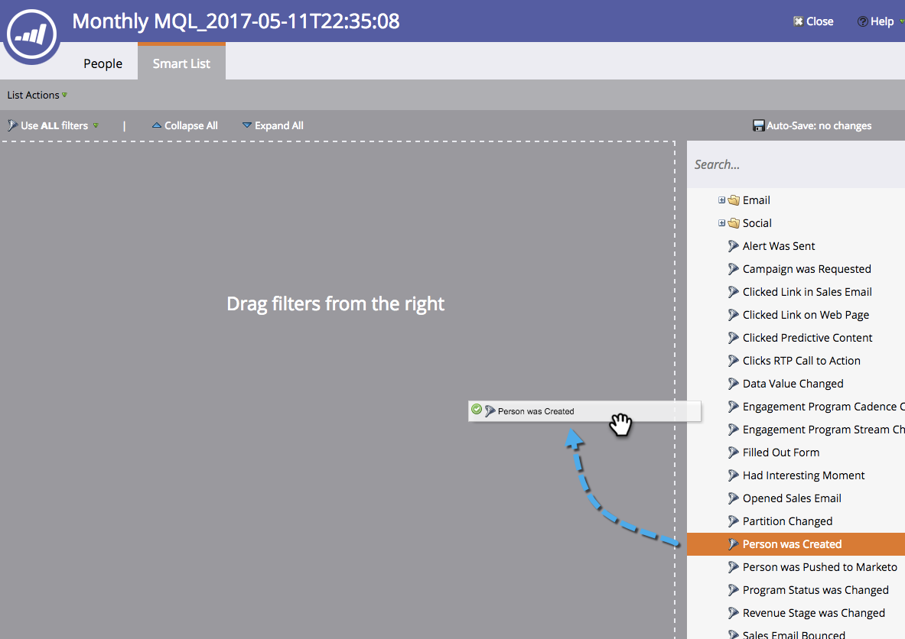

# スマートリストゴールの作成 {#create-a-smart-list-goal}

ゴールとは、進行状況を追跡し、チームを動機付けるための機能です。スマートリストと組み合わせて、Marketo で様々な操作をトラックできます。さらに、スマートリストゴールを設定すると、プレゼンテーションで使用されると 2 時間ごとに自動的に更新されます。

プレゼンテーションと同様、ゴールも[ワークスペース](/help/marketo/product-docs/administration/workspaces-and-person-partitions/understanding-workspaces-and-person-partitions.md)に固有です。

1. **カレンダー**&#x200B;に移動します。

   

1. 右下隅の「**プレゼンテーション**」をクリックします。

   

1. 「**ゴール**」タブを選択します。

   

1. 「**スマートリストゴール**」をキャンバスにドラッグ&amp;ドロップします。

   

1. ゴールの名前を入力し、「**ゴールターゲット**」を入力します。「**作成**」をクリックします。

   

1. [スマートリストの定義](/help/marketo/product-docs/core-marketo-concepts/smart-lists-and-static-lists/creating-a-smart-list/find-and-add-filters-to-a-smart-list.md)を参照してください。可能性は無限です。

   

1. スマートリストがすべて設定されたら、「**閉じる**」ボタンをクリックし、前のタブに戻ります。

   

   確認してみてください。スマートリストゴールが作成されました。

   
