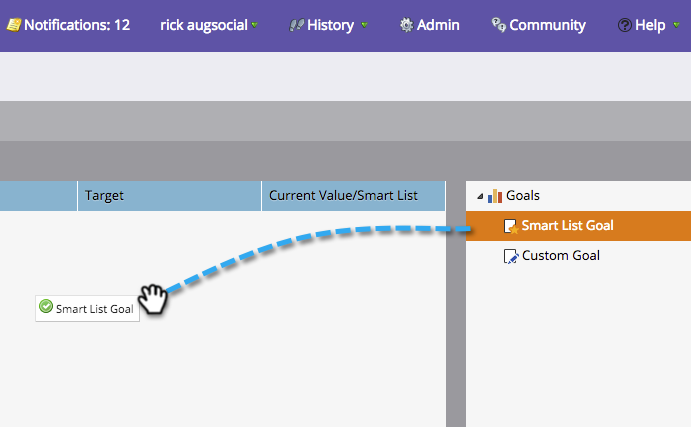
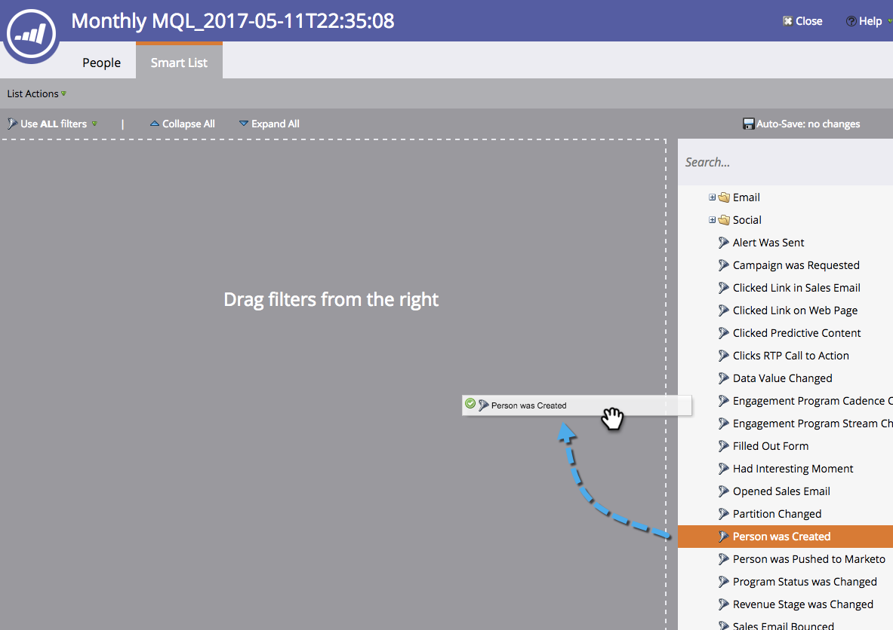
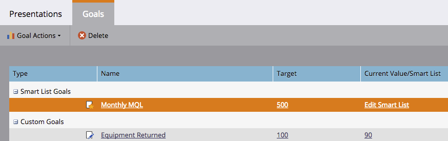

# スマートリストゴールの作成 {#create-a-smart-list-goal}

ゴールとは、進行状況を追跡し、チームを動機付けるための機能です。 スマートリストと組み合わせることで、Marketoのさまざまな指標を追跡できます。 さらに、スマートリスト目標を設定すると、プレゼンテーションで使用されるときに2時間ごとに自動的に更新されます。

プレゼンテーションと同様、ゴールも[ワークスペース](/help/marketo/product-docs/administration/workspaces-and-person-partitions/understanding-workspaces-and-person-partitions.md)に固有です。

1. **[!UICONTROL カレンダー]**&#x200B;に移動します。

   

1. 右下隅の「**[!UICONTROL プレゼンテーション]**」をクリックします。

   

1. 「**[!UICONTROL ゴール]**」タブを選択します。

   

1. 「**[!UICONTROL スマートリストゴール]**」をキャンバスにドラッグ&amp;ドロップします。

   

1. ゴールの名前を入力し、「**[!UICONTROL ゴールターゲット]**」を入力します。 「**[!UICONTROL 作成]**」をクリックします。

   

1. [スマートリストの定義](/help/marketo/product-docs/core-marketo-concepts/smart-lists-and-static-lists/creating-a-smart-list/find-and-add-filters-to-a-smart-list.md)を参照してください。

   

1. スマートリストを設定したら、**[!UICONTROL 閉じる]** ボタンをクリックし、前のタブに戻ります。

   

   スマートリストの目標が作成されました。

   
