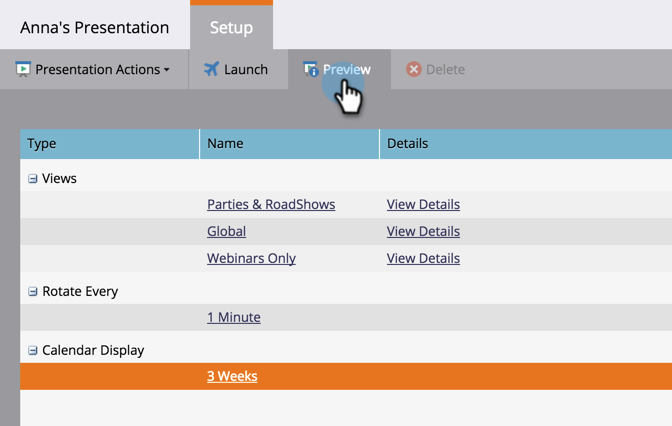
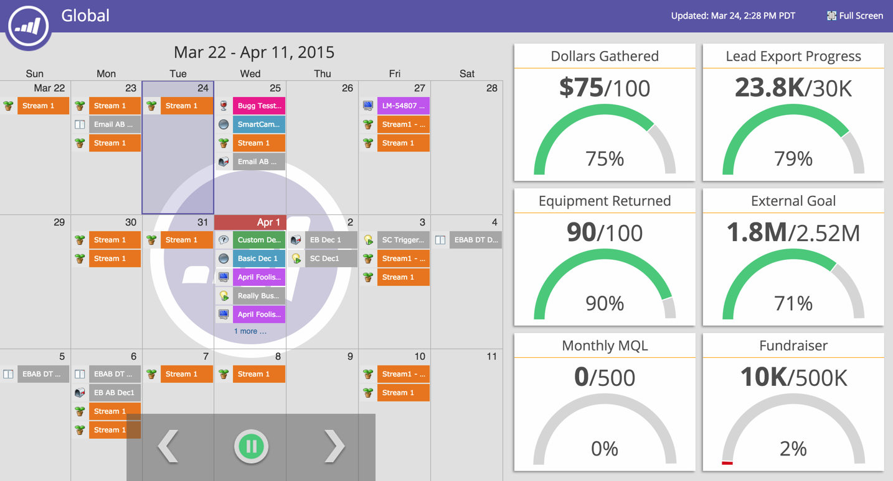

# プレゼンテーションのカスタマイズ {#customize-a-presentation}

チームにとって特に重要なゴールとアクティビティが反映されるように、カレンダプレゼンテーションを設定します。

>[!AVAILABILITY]
>
>
>すべての Marketo Engage ユーザがこの機能を購入しているわけではありません。 詳しくは、アドビのアカウントチーム（担当のアカウントマネージャー）にお問い合わせください。

>[!PREREQUISITES]
>
>* [カスタムゴール](/help/marketo/product-docs/core-marketo-concepts/marketing-calendar/calendar-hd/create-a-custom-goal.md){target="_blank"}または[スマートリストゴール](/help/marketo/product-docs/core-marketo-concepts/marketing-calendar/calendar-hd/create-a-smart-list-goal.md){target="_blank"}の作成
>
>* [プレゼンテーションの作成](/help/marketo/product-docs/core-marketo-concepts/marketing-calendar/calendar-hd/create-a-presentation.md){target="_blank"}

## ビューの選択 {#choosing-the-views}

プレゼンテーションは、選択した各[フィルター定義](/help/marketo/product-docs/core-marketo-concepts/marketing-calendar/working-with-the-calendar/filtering-the-marketing-calendar.md){target="_blank"}で順に表示されます。 必要な数のビューをドラッグし、表示頻度をカスタマイズしてください。

1. 右側のツリーから、プレゼンテーションで順に使用したい各ビューをドラッグします。

   

## ゴールの追加 {#add-a-goal}

プレゼンテーションが最も効果的なのは、チームの目標を表示する場合です。 異なる[ カスタム目標](/help/marketo/product-docs/core-marketo-concepts/marketing-calendar/calendar-hd/create-a-custom-goal.md){target="_blank"}または[ スマートリスト目標](/help/marketo/product-docs/core-marketo-concepts/marketing-calendar/calendar-hd/create-a-smart-list-goal.md){target="_blank"}をドラッグします。 最大 10 個まで使用できます。

1. 右側のツリーから、プレゼンテーションで表示する各ゴールをドラッグします。

   

## ローテーションの表示頻度の設定 {#set-the-frequency-of-rotation}

ビューが取り込まれたら、異なるビュー間で回転する頻度を設定します。

1. **[!UICONTROL 5 分]**&#x200B;をクリックします（これがデフォルトの間隔です）。

   

1. 分単位で時間を入力します。 「**[!UICONTROL 保存]**」をクリックします。

   >[!NOTE]
   >
   >「**[!UICONTROL ローテーションを無効にする]**」をチェックすると、1 つの固定ビューが表示されます。

   

## カレンダー表示の設定 {#set-the-calendar-display}

カレンダー表示は、3 週間または月単位のビューに変更できます。

1. 「**[!UICONTROL カレンダー表示]**」ドロップダウンを選択し、「**[!UICONTROL 3 週間]**」または 1 か「**[!UICONTROL 月]**」のどちらかを選択します。

   

>[!TIP]
>
>プレゼンテーションの[背景画像](/help/marketo/product-docs/core-marketo-concepts/marketing-calendar/calendar-hd/add-a-background-image-to-a-presentation.md){target="_blank"}を設定します。

## プレゼンテーションのプレビュー {#preview-a-presentation}

プレゼンテーションの設定が完了したら、プレビューと起動の準備が整います。

1. 「**[!UICONTROL プレビュー]**」を選択します。

   

   プレゼンテーションが表示されました。

   

   ビューを調整するには、異なるフィルター定義を使用します。

>[!MORELIKETHIS]
>
>* [プレゼンテーションへの背景画像の追加](/help/marketo/product-docs/core-marketo-concepts/marketing-calendar/calendar-hd/add-a-background-image-to-a-presentation.md){target="_blank"}
>* [プレゼンテーションのローンチ](/help/marketo/product-docs/core-marketo-concepts/marketing-calendar/calendar-hd/launch-a-presentation.md){target="_blank"}
