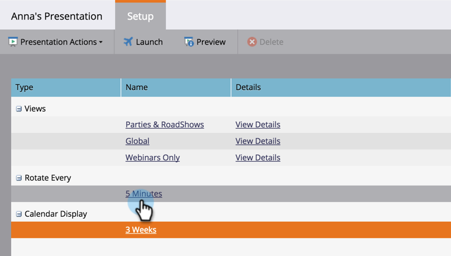

# プレゼンテーションのカスタマイズ {#customize-a-presentation}

チームにとって最も重要な目標とアクティビティを反映するようにカレンダープレゼンテーションを設定します。

>[!NOTE]
>
>**可用性**
>
>この機能を購入していないお客様もいます。 詳細については、セールス担当者にお問い合わせください。

>[!NOTE]
>
>**前提条件**
>
>* [カスタム目標](create-a-custom-goal.md) ( [スマートリスト目標)の作成](create-a-smart-list-goal.md)
   >
   >
* [プレゼンテーションの作成](create-a-presentation.md)

>

## 表示の選択 {#choosing-the-views}

Presentationsは、選択した様々な [フィルター定義を順に切り替え](../../../../product-docs/core-marketo-concepts/marketing-calendar/working-with-the-calendar/filtering-the-marketing-calendar.md) ます。 必要な数の表示を取り込んで、頻度をカスタマイズします。

1. 右のツリーから、プレゼンテーション内で回転させたい別の表示をドラッグします。

   

## 追加目標 {#add-a-goal}

Presentationsはチームの目標を表示する際に最も素晴らしいと思います。 別の [カスタム目標](create-a-custom-goal.md) 、または [スマートリスト目標の上にドラッグするだけ](create-a-smart-list-goal.md)。 10まで使用できます。

1. 右のツリーから、プレゼンテーションに表示したい別の目標をドラッグします。

   

## 回転の頻度を設定 {#set-the-frequency-of-rotation}

プレゼンテーション内の表示を取り込んだら、表示間の回転の頻度を設定します。

1. [** 5分**] （既定のカデンス）をクリックします。

   

1. 分単位で時間を入力します。 「 **保存**」をクリックします。

   >[!NOTE]
   >
   >「回転を **無効にする**」をオンにして、1つの静的な表示を表示します。

   

## カレンダー表示の設定 {#set-the-calendar-display}

カレンダーの表示は、3週間または月別の表示に変更できます。

1. 「 **カレンダー表示** 」ドロップダウンを選択し、 **3週間** 、または1 ****&#x200B;か月を選択します。

   

   すごい！ プレゼンテーションを見る準備は？

>[!TIP]
>
>プレゼンテーションの [背景画像](add-a-background-image-to-a-presentation.md) を設定します。 子猫か虹かを提案します

## プレゼンテーションのプレビュー {#preview-a-presentation}

プレゼンテーションが設定されると、プレビューおよび起動できる状態になります。

1. 「 **プレビュー**」を選択します。

   

   おい！ これがプレゼンテーションの見た目です。

   

   見た物が嫌い？ 前のページに戻って、別のフィルター定義を使用して、目的の表示を作成します。

>[!NOTE]
>
>**関連記事**
>
>* [プレゼ追加ンテーションの背景画像](add-a-background-image-to-a-presentation.md)
>* [プレゼンテーションの開始](launch-a-presentation.md)

>

