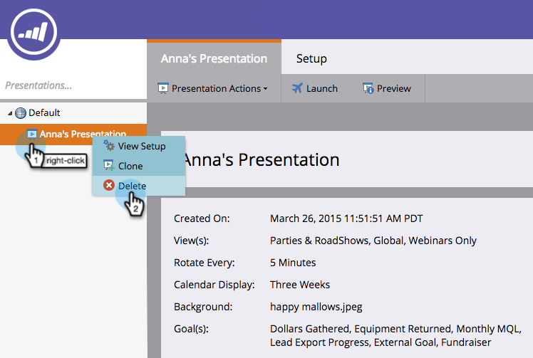

# プレゼンテーションの削除 {#delete-a-presentation}

ときには、物を過剰に持ちすぎていることがあります。古いプレゼンテーションを削除して、新しいプレゼンテーション用のスペースを確保しましょう。

1. プレゼンテーションを選択します。

   

1. 右クリックして「**削除**」を選択します。

   

1. 「**削除**」をクリックして確定します。

   

   完了です。姿が見えなければ、気にすることもありません。
