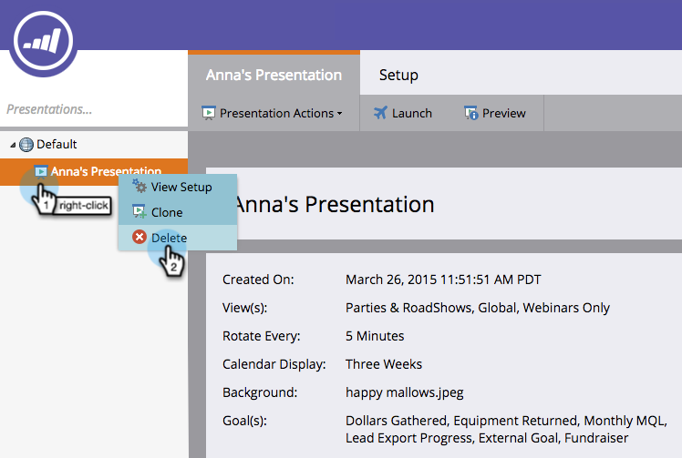

# プレゼンテーションの削除 {#delete-a-presentation}

古いプレゼンテーションを削除して、新しいプレゼンテーション用のスペースを確保します。

1. プレゼンテーションを選択します。

   

1. 右クリックして「**[!UICONTROL 削除]**」を選択します。

   

1. 「**[!UICONTROL 削除]**」をクリックして確定します。

   
