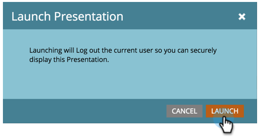

# プレゼンテーションのローンチ {#launch-a-presentation}

ビューと回転頻度を設定したら、プレゼンテーションを起動する準備が整います。

>[!AVAILABILITY]
>
>
>すべての Marketo Engage ユーザがこの機能を購入しているわけではありません。&#x200B; 詳しくは、アドビのアカウントチーム（担当のアカウントマネージャー）にお問い合わせください。

>[!PREREQUISITES]
>
>* [プレゼンテーションの作成](/help/marketo/product-docs/core-marketo-concepts/marketing-calendar/calendar-hd/create-a-presentation.md)
>* [プレゼンテーションのカスタマイズ](/help/marketo/product-docs/core-marketo-concepts/marketing-calendar/calendar-hd/customize-a-presentation.md)

>[!TIP]
>
>起動する前にプレゼンテーションをプレビューします。

1. 「**[!UICONTROL ローンチ]**」をクリックします。

   

1. 「**[!UICONTROL 保存]**」をもう 1 回クリックします。 これにより、Marketo からログアウトされるので、プレゼンテーションを安全に表示できます。

   

   >[!TIP]
   >
   >プレゼンテーションが新しいタブで起動します。 必要に応じて、タブを外部モニターに移動して表示し、**[!UICONTROL フルスクリーン]**&#x200B;をクリックします。
