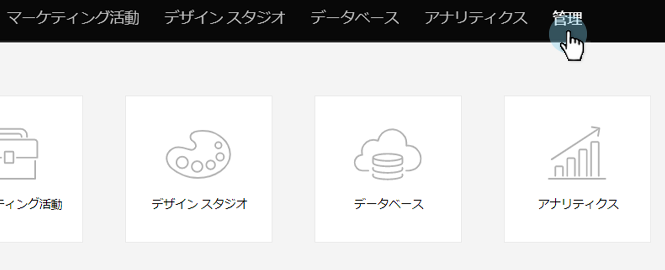
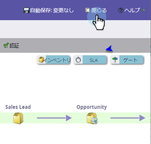

# マーケティングカレンダーのライセンスの発行／取消 {#issue-revoke-a-marketing-calendar-license}

>[!NOTE]
>
>**管理者権限が必要**

[マーケティングカレンダー](/help/marketo/product-docs/core-marketo-concepts/marketing-calendar/understanding-the-calendar/navigating-the-marketing-calendar.md)を操作するには、アクセスする必要があるユーザーにライセンスを発行します。手順は以下のとおりです。

1. **管理**&#x200B;セクションに移動します。

   

1. 「**ユーザーと役割**」をクリックします。

   

1. ユーザーを選択し、「**ライセンスを発行**」をクリックします。

   >[!TIP]
   >
   >**Ctrl/Cmd キーを押しながらクリック**&#x200B;すると、1 回の操作で複数のユーザーを選択できます。

   

1. 「**ライセンスを有効にする**」をオンにし、「**保存**」をクリックします。

   >[!NOTE]
   >
   >ライセンス数は 5 個までです。さらなるライセンスが必要な場合は、自社のセールス担当者にご連絡ください。

   

   これで完了です。「カレンダー」の下の緑のチェックマークを確認してください。

   

これで、スケジュールを立てる準備が整いました。
