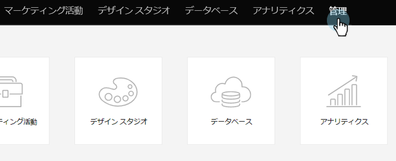
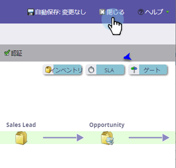
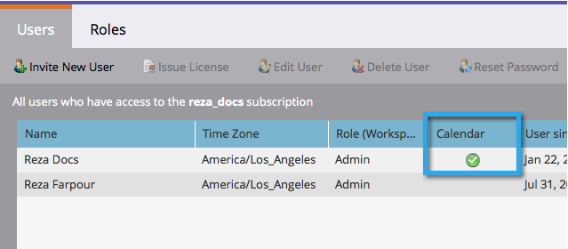

# マーケティングカレンダーライセンスの発行または失効 {#issue-revoke-a-marketing-calendar-license}

>[!NOTE]
>
>**管理者権限が必要**

[マーケティングカレンダー](/help/marketo/product-docs/core-marketo-concepts/marketing-calendar/understanding-the-calendar/navigating-the-marketing-calendar.md){target="_blank"}を操作するには、アクセスする必要があるユーザーにライセンスを発行します。

1. 「**[!UICONTROL 管理者]**」セクションに移動します。

   

1. 「**[!UICONTROL ユーザー＆ロール]**」をクリックします。

   

1. ユーザーを選択し、「**[!UICONTROL ライセンスを発行]**」。

   >[!TIP]
   >
   >**Ctrl／Cmd キーを押しながらクリック**&#x200B;すると、1 回の操作で複数のユーザーを選択できます。

   

1. **[!UICONTROL ライセンスを有効化]**&#x200B;を確認し、「**[!UICONTROL 保存]**」。

   >[!NOTE]
   >
   >ライセンス数は 5 個までです。 さらに必要な場合は、自社のセールス担当者にお問い合わせください。

   

   緑のチェックマークが&#39;[!UICONTROL  カレンダー]&#39;の下に表示されるようになりました。

   
