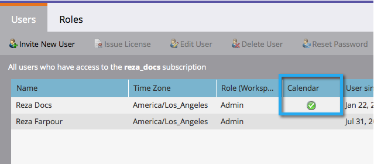

# マーケティングカレンダーライセンスの発行/取り消し{#issue-revoke-a-marketing-calendar-license}

>[!NOTE]
>
>**必要な管理者権限**

[マーケティングカレンダー](/help/marketo/product-docs/core-marketo-concepts/marketing-calendar/understanding-the-calendar/navigating-the-marketing-calendar.md)のシートを利用するには、アクセスを必要とするユーザーにライセンスを発行する必要があります。 これが方法です。

1. **管理者**&#x200B;セクションに移動します。

   

1. 「**ユーザーとロール**」をクリックします。

   

1. ユーザーを選択し、「**雑誌号ライセンスを発行」をクリックします。**

   >[!TIP]
   >
   >**Ctrl/Cmdキーを押しながら**&#x200B;をクリックすると、1回の操作で複数のユーザーを選択できます。

   

1. 「**ライセンスを有効にする**」を選択し、「**保存**」をクリックします。

   >[!NOTE]
   >
   >ライセンス数は5個に制限されています。 詳しくは、担当営業にお問い合わせください。

   

   うまくいった！ 「カレンダー？」の下の緑のチェックマークを確認する

   

Awesome — 予定を立てる準備ができました。
