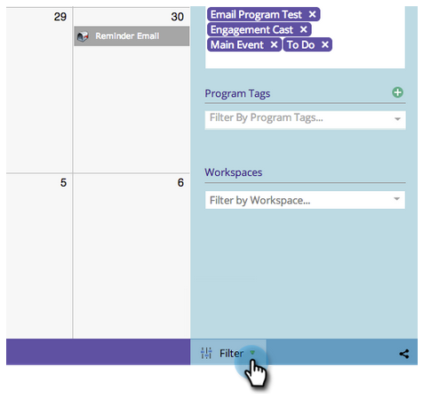
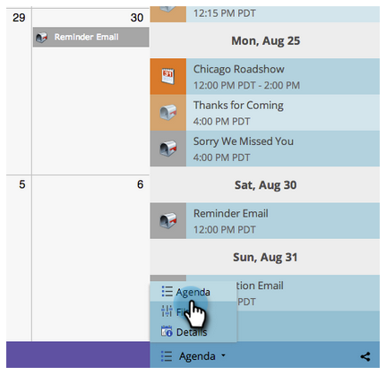

# マーケティングカレンダーの操作 {#navigating-the-marketing-calendar}

マーケティングカレンダーのナビゲーション方法を説明します。

>[!PREREQUISITES]
>
>[&#x200B; マーケティングカレンダーライセンス &#x200B;](/help/marketo/product-docs/core-marketo-concepts/marketing-calendar/understanding-the-calendar/issue-revoke-a-marketing-calendar-license.md){target="_blank"}を持っていることを確認してください。そうしないと、マーケティングカレンダータイルがMy Marketoに表示されません。

>[!NOTE]
>
>定期的なスマートキャンペーンは、マーケティングカレンダーではサポートされていません。

1. **マーケティングカレンダー**&#x200B;に移動します。

   

1. これが、現在の Marketo インスタンスでスケジュールされているアセットの全体図です。

   

## モードの切り替え {#change-between-modes}

1. 「**[!UICONTROL 3 週間]**」または「**[!UICONTROL 月]**」のタブをクリックして、モードを切り替えます。

   

## アジェンダビューの使用 {#use-the-agenda-view}

アジェンダビューには、すべてのエントリがリストとして表示されます。

1. 「**&#x200B;**&#x200B;フィルター」ドロップダウンをクリックします。

   

1. 「**[!UICONTROL アジェンダ]**」ビューを選択します。

   

   このビューには、予定されているすべてが表示されます。

   

## 時間のナビゲーション {#navigate-through-time}

ナビゲーションボタンをクリックします。

また、次のキーボードショートカットを使用することもできます。

| アクション | キーボードショートカット |
|---|---|
| 時間を戻る | Alt／opt + 上矢印 |
| 時間を進む | Alt／opt + 下矢印 |
| 「今日」に移動 | Alt／opt + T |

以上が基本です。 フィルターを使用して表示をカスタマイズすることもできます。

>[!MORELIKETHIS]
>
>[マーケティングカレンダーのフィルタリング](/help/marketo/product-docs/core-marketo-concepts/marketing-calendar/working-with-the-calendar/filtering-the-marketing-calendar.md){target="_blank"}
