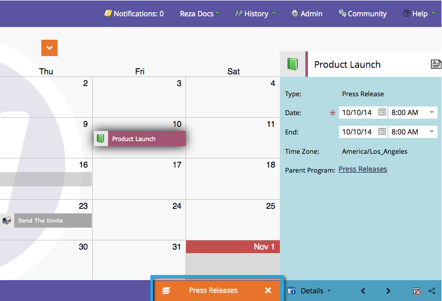

# プログラムの焦点を理解して有効にする {#understand-enable-program-focus}

マーケティングカレンダーでは全体を俯瞰して表示できますが、一部のエントリに対して操作を行うこともできます。 エントリを[作成](/help/marketo/product-docs/core-marketo-concepts/marketing-calendar/working-with-the-calendar/create-entries-directly-in-the-marketing-calendar.md){target="_blank"}、[編集](/help/marketo/product-docs/core-marketo-concepts/marketing-calendar/working-with-the-calendar/edit-entries-directly-in-the-marketing-calendar.md){target="_blank"}、[削除](/help/marketo/product-docs/core-marketo-concepts/marketing-calendar/working-with-the-calendar/delete-entries-directly-in-the-marketing-calendar.md){target="_blank"}および[確認](/help/marketo/product-docs/core-marketo-concepts/marketing-calendar/working-with-the-calendar/confirm-entries-directly-in-the-marketing-calendar.md){target="_blank"}できます。 エントリを操作するには、まずプログラムにフォーカスを合わせる必要があります。

1. **マーケティングカレンダー**&#x200B;に移動します。

   

1. エントリを選択し、「**[!UICONTROL プログラムフォーカスを表示]**」をクリックします。

   

1. 現在は「プレスリリース」に重点を置いています。

   

   >[!NOTE]
   >
   >プログラムをフォーカスすると、そのプログラムに属するエントリのみを操作でき、プログラムに格納される新しいエントリを作成できます。

1. 完了したら、フォーカスをリリースして、他のプログラムやエントリと対話します。

   

エントリの操作方法については、以下のリンクを使用してください。

>[!MORELIKETHIS]
>
>* [マーケティングカレンダーでエントリを直接作成](/help/marketo/product-docs/core-marketo-concepts/marketing-calendar/working-with-the-calendar/create-entries-directly-in-the-marketing-calendar.md){target="_blank"}
>* [マーケティングカレンダーでエントリを直接編集](/help/marketo/product-docs/core-marketo-concepts/marketing-calendar/working-with-the-calendar/edit-entries-directly-in-the-marketing-calendar.md){target="_blank"}
>* [マーケティングカレンダーでエントリを直接削除](/help/marketo/product-docs/core-marketo-concepts/marketing-calendar/working-with-the-calendar/delete-entries-directly-in-the-marketing-calendar.md){target="_blank"}
>* [マーケティングカレンダーでエントリを直接確認](/help/marketo/product-docs/core-marketo-concepts/marketing-calendar/working-with-the-calendar/confirm-entries-directly-in-the-marketing-calendar.md){target="_blank"}
