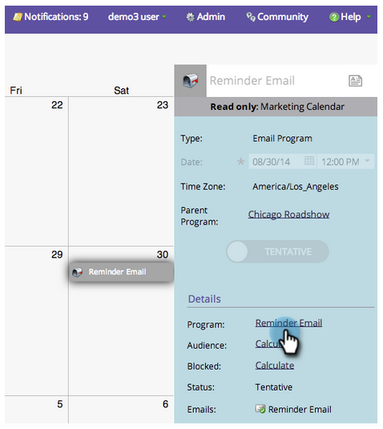

# 表示エントリの詳細{#view-entry-details}

マーケティングカレンダーで表示入力の詳細を表示すると、エントリに関する様々なクールな情報を表示できます。

1. カレンダーからエントリを選択します。

   

1. マーケティングカレンダーのエントリは読み取り専用です。 編集するプログラムに移動します。

   

>[!TIP]
>
>右側の詳細を右クリックしてみてください。 エディターを移動またはポップアップするメニューを表示できます。 いいだろ？
