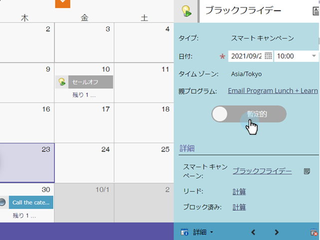

# マーケティングカレンダーでエントリを直接確認 {#confirm-entries-directly-in-the-marketing-calendar}

スマートキャンペーンとメールプログラムは、仮のエントリとして作成でき、実際に何が起こるかを確認する必要があります。手順は以下のとおりです。

1. **カレンダー**&#x200B;に移動します。

   

1. 確認するエントリを選択し、「**プログラムフォーカスを表示**」をクリックします。

   

1. 先に進み、エントリを確認します。

   

   確認では一連の検証プロセスが実行され、すべてがチェックアウトされた場合、エントリが確認されます。

   
