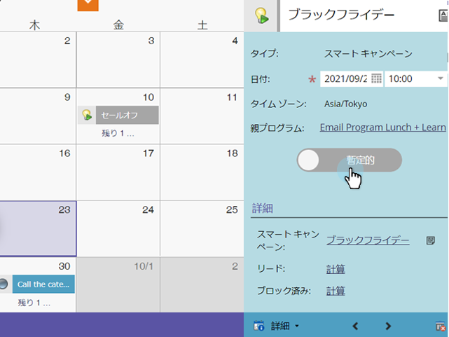

# マーケティングカレンダーでのエントリの直接確認 {#confirm-entries-directly-in-the-marketing-calendar}

スマートキャンペーンとメールプログラムは仮のエントリとして作成でき、そのままでは何も実行されないため、確認が必要です。

1. **[!UICONTROL カレンダー]**&#x200B;に移動します。

   

1. 確認するエントリを選択し、「**[!UICONTROL プログラムフォーカスを表示]**」をクリックします。

   

1. エントリを確認します。

   

   確認を行うと一連の検証プロセスが実行され、すべてに問題がなければエントリが確定します。

   
