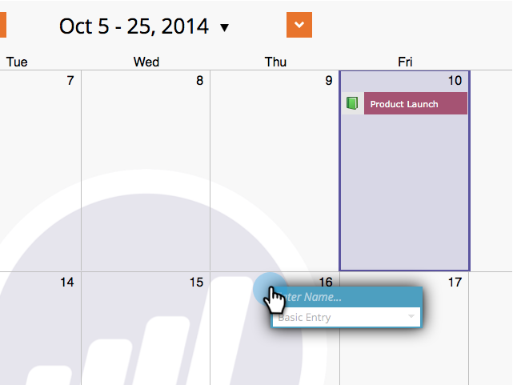

# マーケティングカレンダーでの直接エントリの作成{#create-entries-directly-in-the-marketing-calendar}

Marketing Targetでは、プログラムフォーカスモードを使用して、マーケティングカレンダーに直接エントリを作成できます。 次のエントリタイプを作成できます。

* 基本エントリ
* カスタムエントリ
* 電子メールプログラム
* スマートキャンペーン

これが方法です。

1. **カレンダー**&#x200B;に移動します。

   

1. 前のエントリを選択し、「**プログラムフォーカスを表示**」をクリックします。

   

1. プログラムフォーカスモードになったら、エントリを追加する日を選択します。

   

1. エントリに名前を付け、タイプを選択します。

   

   >[!TIP]
   >
   >同様に、**スマートキャンペーン**、**電子メールプログラム**、**基本エントリ**&#x200B;も作成できます。

1. 編集が完了したら、プログラムフォーカスモードを閉じます。

   

>[!MORELIKETHIS]
>
>[マーケティングカレンダーでのエントリの直接編集](edit-entries-directly-in-the-marketing-calendar.md)
