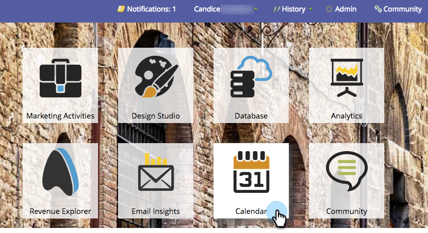

# マーケティングカレンダーでエントリを直接削除 {#delete-entries-directly-in-the-marketing-calendar}

エントリの[作成](/help/marketo/product-docs/core-marketo-concepts/marketing-calendar/working-with-the-calendar/create-entries-directly-in-the-marketing-calendar.md){target="_blank"}および[編集](/help/marketo/product-docs/core-marketo-concepts/marketing-calendar/working-with-the-calendar/edit-entries-directly-in-the-marketing-calendar.md){target="_blank"}に加えて、マーケティングカレンダーで直接エントリを削除できます。

1. **MU** タイルをクリックします。

   

1. 削除するエントリを選択し、「**[!UICONTROL プログラムフォーカスを表示]**」をクリックします。

   

1. ごみ箱アイコンをクリックします。

   

エントリによっては、削除を確定する必要があります。

>[!MORELIKETHIS]
>
>[マーケティングカレンダーでエントリを直接確認](/help/marketo/product-docs/core-marketo-concepts/marketing-calendar/working-with-the-calendar/confirm-entries-directly-in-the-marketing-calendar.md){target="_blank"}
