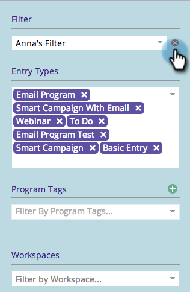

# マーケティングカレンダーでのフィルターの削除 {#deleting-a-filter-in-the-marketing-calendar}

マーケティングカレンダーでフィルターを削除する場合は、以下の手順に従います。

1. 削除するフィルターを選択します。

   

1. 赤い「**x**」をクリックします。

   

1. 「**[!UICONTROL 削除]**」をクリックして確定します。

   
