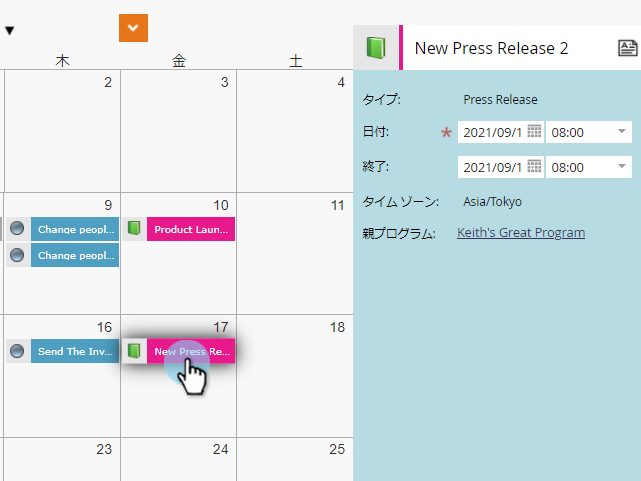
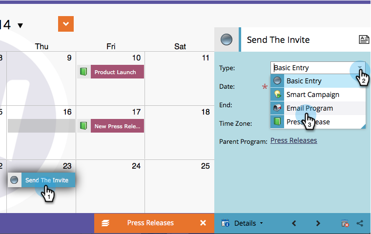

# マーケティングカレンダーでエントリを直接編集{#edit-entries-directly-in-the-marketing-calendar}

プログラムフォーカスモードになると、カレンダーエントリをすばやく変更できます。 これが方法です。

## プログラムフォーカスを有効にする{#enable-program-focus}

1. **カレンダー**&#x200B;に移動します。

   

1. フォーカスするプログラムに属するエントリを選択し、「**プログラムフォーカスを表示**」をクリックします。

   

## エントリの再スケジュール{#reschedule-entry}

1. エントリをドラッグ&amp;ドロップするだけで、エントリを再スケジュールできます。

   

## エントリ名の編集{#edit-entry-name}

1. 名前を変更するエントリを選択します。

   

1. エントリ名を編集します。

   

   >[!TIP]
   >
   >説明を編集することもできます。
   >
   >

## エントリタイプの変換{#convert-entry-type}

基本的な入力をすぐに入力した後は、最終的な形式に変換できます。

1. 変換する基本エントリを探して選択し、種類を変更します。

   

## 参加者の詳細を編集{#edit-entry-details}

エントリの様々な領域にすばやくアクセスして編集できます。

1. エントリを右クリックし、編集する領域を選択します。

   

それだ！ 表示されるように、マーケティングカレンダーから直接実行できることは多数あります。

>[!MORELIKETHIS]
>
>[マーケティングカレンダーでのエントリの直接削除](/help/marketo/product-docs/core-marketo-concepts/marketing-calendar/working-with-the-calendar/delete-entries-directly-in-the-marketing-calendar.md)
