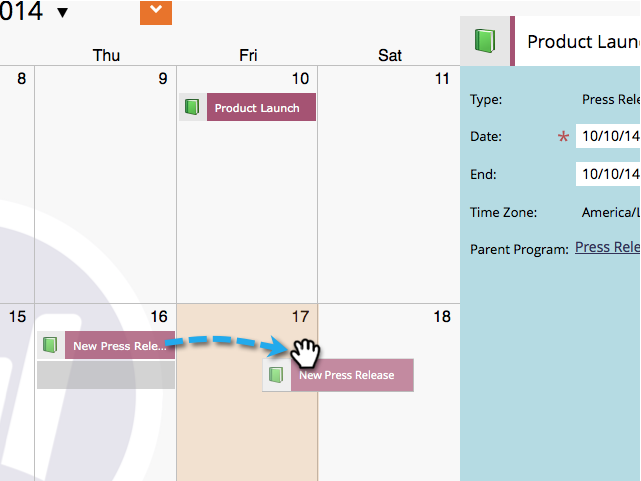

# マーケティングカレンダーでエントリを直接編集 {#edit-entries-directly-in-the-marketing-calendar}

プログラムフォーカスモードにしたら、素早くカレンダーエントリを変更できます。手順は以下のとおりです。

## プログラムフォーカスの有効 {#enable-program-focus}

1. **[!UICONTROL カレンダー]** タイルをクリックします。

   

1. フォーカスするプログラムに属するエントリを選択し、「**[!UICONTROL プログラムフォーカスを表示]**」をクリックします。

   

## エントリの再スケジュール {#reschedule-entry}

1. エントリをドラッグ＆ドロップして再スケジュールします。

   

## エントリ名の編集 {#edit-entry-name}

1. 名前を変更するエントリを選択します。

   

1. エントリ名を編集します。

   

   >[!TIP]
   >
   >説明を編集することもできます。
   >
   >

## エントリタイプの変換 {#convert-entry-type}

基本エントリをすぐに入力した後、最終的な形式に変換できます。

1. 変換する基本エントリを探して選択し、タイプを変更します。

   

## エントリ詳細の編集 {#edit-entry-details}

エントリの様々な領域に素早くアクセスして編集できます。

1. エントリを右クリックし、編集する領域を選択します。

   

これで完了です。ご覧のように、マーケティングカレンダーから直接できることはたくさんあります。

>[!MORELIKETHIS]
>
>[マーケティングカレンダーでエントリを直接削除](/help/marketo/product-docs/core-marketo-concepts/marketing-calendar/working-with-the-calendar/delete-entries-directly-in-the-marketing-calendar.md){target="_blank"}
