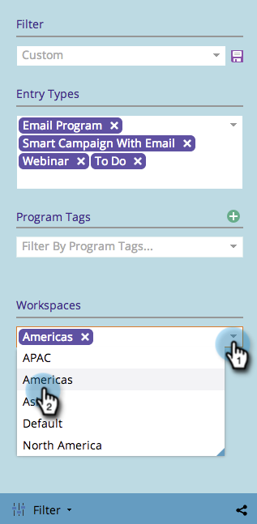

# ワークスペースでのマーケティングカレンダーのフィルタリング{#filtering-the-marketing-calendar-by-workspace}

マーケティングカレンダーは、特定のワークスペース内のオブジェクトでフィルタリングできます。

1. **カレンダー**&#x200B;に移動します。

   

1. フィルターパネルで、「**ワークスペース**」ドロップダウンを選択します。 目的のワークスペースを選択します。

   

   素晴らしい！ 現在は、その特定のワークスペースに構築されたオブジェクトのみが表示されます。

   >[!NOTE]
   >
   >[マーケティングカレンダーでのフィルター定義の保存](/help/marketo/product-docs/core-marketo-concepts/marketing-calendar/working-with-the-calendar/saving-a-filter-definition-in-the-marketing-calendar.md)
