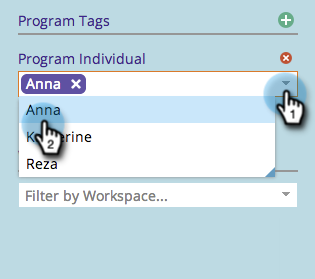

# マーケティングカレンダーのフィルタリング {#filtering-the-marketing-calendar}

カレンダーに表示する情報をフィルタリングするには、エントリの種類、プログラムタグ、またはワークスペースを使用します。

1. 「**[!UICONTROL カレンダー]**」タイルをクリックします。

1. 「**[!UICONTROL エントリタイプ]**」ドロップダウンリストをクリックします。

   >[!NOTE]
   >
   >デフォルトのエントリタイプは、**[!UICONTROL 電子メール]** **[!UICONTROL プログラム]**&#x200B;と&#x200B;**[!UICONTROL 電子メール付きスマートキャンペーン]**&#x200B;です。

   

1. フィルターに追加する追加のエントリタイプを選択します。

   

   >[!TIP]
   >
   >標準エントリタイプの詳細については、[&#x200B; プログラムスケジュール表示エントリタイプ &#x200B;](/help/marketo/product-docs/core-marketo-concepts/programs/program-schedule-view/program-schedule-view-entry-types.md){target="_blank"}を参照してください。

1. 関心のあるプログラムタグを選択します。

   

1. タグ値を選択します。

   

   定義されたフィルターに一致するエントリのみが表示されるようになりました。

   >[!NOTE]
   >
   >[マーケティングカレンダーでのフィルター定義の保存](/help/marketo/product-docs/core-marketo-concepts/marketing-calendar/working-with-the-calendar/saving-a-filter-definition-in-the-marketing-calendar.md){target="_blank"}
