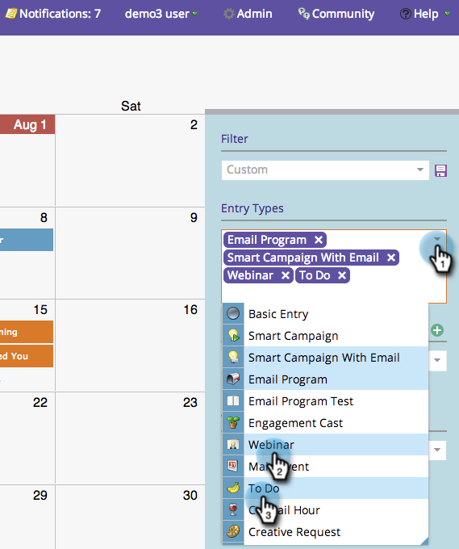

# マーケティングカレンダーでフィルター定義を保存する {#saving-a-filter-definition-in-the-marketing-calendar}

フィルターを保存すると、異なるフィルター定義を切り替えることができます。

>[!PREREQUISITES]
>
>[マーケティングカレンダーのフィルタリング](/help/marketo/product-docs/core-marketo-concepts/marketing-calendar/working-with-the-calendar/filtering-the-marketing-calendar.md){target="_blank"}

1. フィルターを定義します。

   

1. 「保存」アイコンをクリックします。

   

1. フィルターに名前を付けます。 「**[!UICONTROL 保存]**」をクリックします。

   

   フィルターが保存されました。

   

   オプションで、[定義のコピー](/help/marketo/product-docs/core-marketo-concepts/marketing-calendar/working-with-the-calendar/sharing-a-filter-definition-in-the-marketing-calendar.md){target="_blank"}を他のMarketo ユーザーに送信します。

   >[!NOTE]
   >
   >[マーケティングカレンダーでのフィルター定義の共有](/help/marketo/product-docs/core-marketo-concepts/marketing-calendar/working-with-the-calendar/sharing-a-filter-definition-in-the-marketing-calendar.md){target="_blank"}
