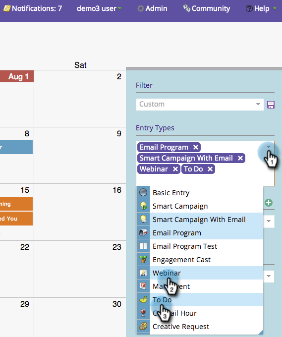

# マーケティングカレンダーへのフィルター定義の保存{#saving-a-filter-definition-in-the-marketing-calendar}

フィルターを保存すると、様々なフィルター定義を切り替えることができます。

>[!PREREQUISITES]
>
>* [マーケティングカレンダーのフィルタリング](filtering-the-marketing-calendar.md)

>

1. フィルターを定義します。

   

1. 保存アイコンをクリックします。

   

1. フィルターに名前を付けます。 「**保存**」をクリックします。

   

   急げ！ これで、フィルターが保存されます。

   

   必要に応じて、定義のコピー[を他のマーケティング担当者に送信できます。](sharing-a-filter-definition-in-the-marketing-calendar.md)

   >[!NOTE]
   >
   >**関連記事**
   >
   >    
   >    
   >    * [マーケティングカレンダーでのフィルター定義の共有](sharing-a-filter-definition-in-the-marketing-calendar.md)

