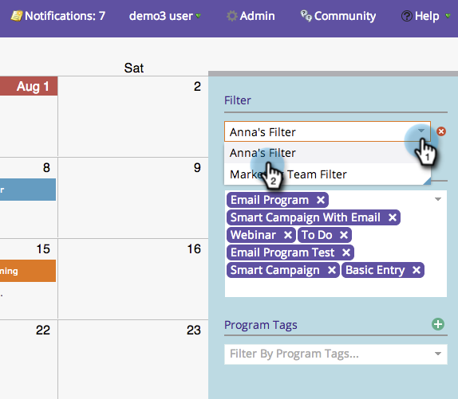

# マーケティングカレンダーでのフィルター定義の共有 {#sharing-a-filter-definition-in-the-marketing-calendar}

フィルターは、様々なユーザー間で共有できます。

>[!PREREQUISITES]
>
>* [マーケティングカレンダーでのフィルターの作成](/help/marketo/product-docs/core-marketo-concepts/marketing-calendar/working-with-the-calendar/filtering-the-marketing-calendar.md)
>* [マーケティングカレンダーでのフィルター定義の保存](/help/marketo/product-docs/core-marketo-concepts/marketing-calendar/working-with-the-calendar/saving-a-filter-definition-in-the-marketing-calendar.md)

>[!NOTE]
>
> 保存したフィルターに変更を加えた場合は、そのフィルターを再共有します。編集した内容は、他のユーザーには反映されません。

1. 共有するフィルターを選択します。

   

1. 右下隅の共有アイコンをクリックします。

   

1. URL をコピーして、他の Marketo ユーザーと共有します。

   

   >[!NOTE]
   >
   >ユーザー権限は表示に影響を与えます。
