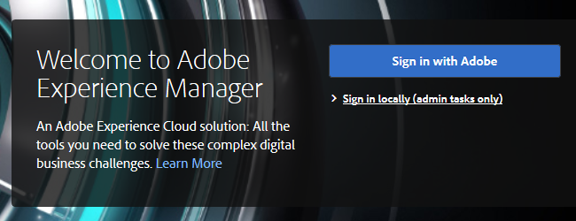

# Adobe Experience Manager 統合の設定 {#configuring-adobe-experience-manager-integration}

AEMアセットにアクセスし、選択し、Marketo Design Studio に読み込めるようにAEMを設定します。

>[!NOTE]
>
>**管理者権限が必要**

>[!CAUTION]
>
>現在、この機能は Firefox でのみ完全にサポートされています。Safari ではサポートされていないので、SameSite cookie の設定によっては、最新バージョンの Chrome では動作しない可能性があります。

1. Adobe Experience Managerに移動します（この URL は会社に固有のものです）。

   

1. ユーザーは、Adobeでログインするか、ローカルでログインすることができます。 この例では、ローカルでサインインします。

   

1. In **ツール**&#x200B;をクリックし、 **運用** を選択し、 **Web コンソール**.

   

1. ブラウザーで、「AdobeGranite クロスオリジンリソース共有ポリシー」を検索 (Windows では ctrl+f、Macでは cmd+f) します。

   

1. 次をクリック： **+** 右側にサインします。

   

1. 内 **許可された起源（正規表現）** テキストボックス、入力 `https://.*\.marketo\.com` をクリックし、 **保存**.

   

1. ページ上部のヘッダーで、 **Web コンソール** を選択し、 **システム情報**.

   

1. [ サーバ情報 ] で、 **再起動** 」ボタンをクリックします。

   

1. クリック **OK** をクリックして確定します。

   

1. Marketo Classicで、 **管理者**.

   

1. 「統合」で、「 **Adobe Experience Manager**.

   

1. 「**編集**」をクリックします。

   

1. AEM URL を入力し、 **OK**.

   

   準備は整った！ 次の操作を実行できます。 [AEMアセットを Design Studio のMarketo Skyに読み込む](https://experienceleague.adobe.com/docs/marketo/sky/design-studio/importing-assets-with-adobe-experience-manager.html?lang=en#design-studio).
