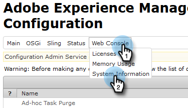

# Adobe Experience Manager 統合の設定 {#configuring-adobe-experience-manager-integration}

Adobe Experience Manager（AEM）を設定し、AEM のアセットにアクセスして選択し、Marketo Engage デザインスタジオに読み込めるようにします。

>[!NOTE]
>
>**管理者権限が必要**

>[!IMPORTANT]
>
>* この統合は、AEM のオンプレミス実装でのみ機能し、AEM Cloud Service 実装ではサポートされません。
>
>* 現在、この機能は Firefox でのみ完全にサポートされています。 Safari ではサポートされていません。また、SameSite の Cookie 設定によっては、最新バージョンの Chrome では動作しない可能性があります。

1. Adobe Experience Manager に移動します（URL は会社に固有のものです）。

   

1. ユーザは、アドビでログインするか、ローカルでログインできます。 この例では、ローカルログインを使用します。

   

1. 「**[!UICONTROL ツール]**」で、「**[!UICONTROL 運用]**」をクリックし、「**[!UICONTROL web コンソール]**」を選択します。

   

1. ブラウザーで、「[!UICONTROL Adobe Granite クロスオリジンリソース共有ポリシー]」を検索します（Windows では Ctrl + F キー、Mac では Cmd + F キー）。

   

1. 右側の「**+**」記号をクリックします。

   

1. 「**[!UICONTROL 許可済み接触チャネル（正規表現）]**」テキストボックスに、`https://.*\.marketo\.com` と入力し、「**[!UICONTROL 保存]**」をクリックします。

   

1. ページ上部のヘッダーで、「**[!UICONTROL Web コンソール]**」を選択し、「**[!UICONTROL システム情報]**」を選択します。

   

1. 「サーバー情報」で、「**[!UICONTROL 再起動]**」ボタンをクリックします。

   

1. 「**[!UICONTROL OK]**」をクリックして続行します。

   

1. Marketo Engage で、「**[!UICONTROL 管理者]**」をクリックします。

   

1. 「統合」で、「**[!UICONTROL Adobe Experience Manager]**」を選択します。

   

1. 「**[!UICONTROL 編集]**」をクリックします。

   

1. AEM の URL を入力し、「**[!UICONTROL OK]**」をクリックします。

   
