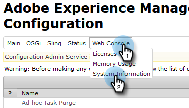

# Adobe Experience Manager統合の設定{#configuring-adobe-experience-manager-integration}

AEMを設定し、AEMアセットにアクセス、選択およびMarketoのDesign Studioへの読み込みを行うことができます。

>[!NOTE]
>
>**必要な管理者権限**

>[!CAUTION]
>
>現在、この機能はFirefoxでのみ完全にサポートされています。 Safariではサポートされていないため、SameSite Cookieの設定によっては、最新バージョンのChrome(v. 80)では動作しない場合があります。

1. Adobe Experience Managerに移動します(URLは会社に固有です)。

   

1. Adobeを使用してサインインするか、ローカルでサインインすることができます。 この例では、ローカルにサインインします。

   

1. **ツール**&#x200B;で、**操作**&#x200B;をクリックし、**Webコンソール**&#x200B;を選択します。

   

1. ブラウザーで、（Windowsではctrl + fキー、Macではcmd + fキー）に対して「AdobeGranite Cross-接触チャネルリソース共有ポリシー」を検索します。

   

1. 右側の&#x200B;**+**&#x200B;記号をクリックします。

   

1. 「**許可されている接触チャネル(Regexp)**」テキストボックスに、`https://.*\.marketo\.com`に入力し、「**保存**」をクリックします。

   

1. ページ上部のヘッダーで、「**Webコンソール**」をクリックし、「**システム情報**」を選択します。

   

1. 「Server Information」で、「**Restart**」ボタンをクリックします。

   

1. 「**OK**」をクリックして確認します。

   

1. Marketo Classicで、**管理者**&#x200B;をクリックします。

   

1. 「統合」で、**Adobe Experience Manager**&#x200B;を選択します。

   

1. 「**編集**」をクリックします。

   

1. AEM URLを入力し、「**OK**」をクリックします。

   

   準備万端！ これで、Marketo Sky](https://experienceleague.adobe.com/docs/marketo/sky/design-studio/importing-assets-with-adobe-experience-manager.html?lang=en#design-studio)のDesign StudioにAEMアセットを[読み込むことができるようになりました。
