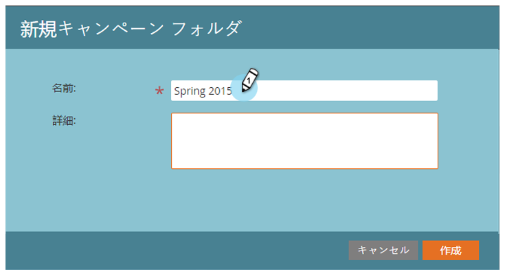

# 新しいキャンペーンフォルダーの作成{#create-new-campaign-folder}

キャンペーンフォルダーを使用すると、Tidyワークスペースを整理しやすくなります。 次の簡単な手順に従うと、自動化の魔法を使うことができます。

1. **マーケティングアクティビティ**&#x200B;に移動します。

   

1. 「**新規**」を選択します。

   

1. 「**新しいキャンペーンフォルダー**」を選択します。

   

1. キャンペーンフォルダーの&#x200B;**名前**&#x200B;を入力します。

   

1. オプション：**説明**&#x200B;を入力し、**作成**&#x200B;をクリックします。

   >[!TIP]
   >
   >説明は、購読上の他のユーザー向けです。 このメッセージはユーザーに表示されません。

   

   すごい！ キャンペーンフォルダーを作成したとき。 ツリーで調べてみてください。

   

   [新しいプログラム](/help/marketo/product-docs/core-marketo-concepts/programs/creating-programs/create-a-program.md)を作成すると、このキャンペーンフォルダーがオプションとして表示されます。

>[!MORELIKETHIS]
>
>* [プログラムの作成](/help/marketo/product-docs/core-marketo-concepts/programs/creating-programs/create-a-program.md)
>* [新しいスマートキャンペーンの作成](/help/marketo/product-docs/core-marketo-concepts/smart-campaigns/creating-a-smart-campaign/create-a-new-smart-campaign.md)

