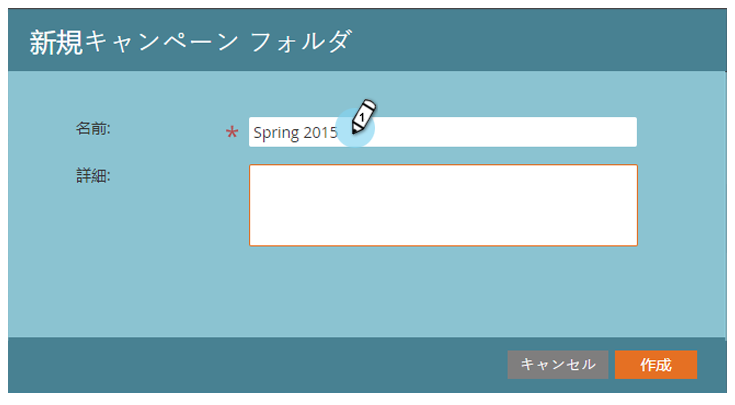

# キャンペーンフォルダーの新規作成 {#create-new-campaign-folder}

キャンペーンフォルダーは、整理されたワークスペースを維持するのに役立ちます。これらの簡単な手順に従うと、自動処理マジックに進みます。

1. **[!UICONTROL マーケティングアクティビティ]**&#x200B;に移動します。

   

1. 「**[!UICONTROL 新規]**」を選択します。

   

1. 「**[!UICONTROL 新規キャンペーンフォルダー]**」を選択します。

   

1. キャンペーンフォルダーの&#x200B;**[!UICONTROL 名前]**&#x200B;を入力します。

   

1. オプション：「**[!UICONTROL 説明]**」を入力して「**[!UICONTROL 作成]**」をクリックします。

   >[!TIP]
   >
   >説明は、サブスクリプションの他のユーザー向けです。このメッセージは顧客には表示されません。

   

   これで完了です。キャンペーンフォルダーを作成しました。ツリーで確認しましょう。

   

   これで、[新しいプログラムを作成](/help/marketo/product-docs/core-marketo-concepts/programs/creating-programs/create-a-program.md)すると、このキャンペーンフォルダーがオプションとして表示されます。

>[!MORELIKETHIS]
>
>* [プログラムの作成](/help/marketo/product-docs/core-marketo-concepts/programs/creating-programs/create-a-program.md)
>* [新規スマートキャンペーンの作成](/help/marketo/product-docs/core-marketo-concepts/smart-campaigns/creating-a-smart-campaign/create-a-new-smart-campaign.md)
