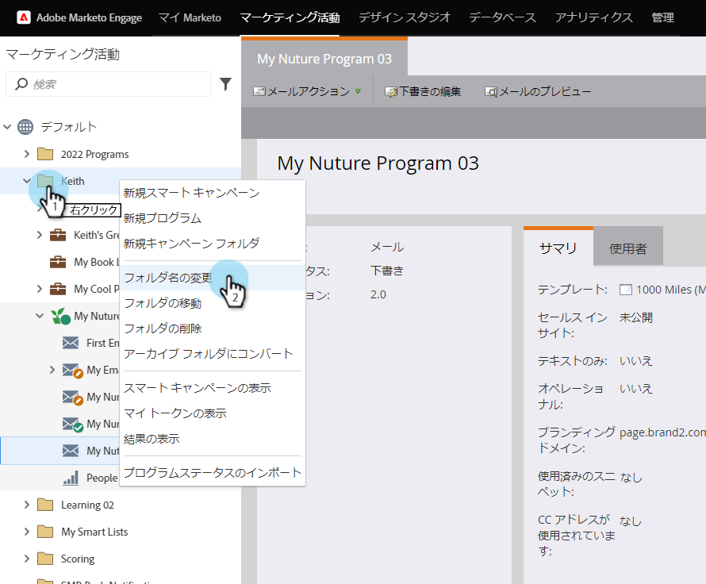

# フォルダーについて {#understanding-folders}

プログラム内のフォルダーを使用して、スマートキャンペーンとアセットを整理できます。これらは[キャンペーンフォルダー](/help/marketo/product-docs/core-marketo-concepts/miscellaneous/create-new-campaign-folder.md)とは異なります。

## フォルダーの作成 {#create-a-folder}

1. **マーケティングアクティビティ**&#x200B;領域に移動します。

   

1. プログラムを右クリックし、「**新規フォルダー**」を選択します。

   

1. 新しいフォルダーに名前を付け、**Enter** を押します。

   

完成です。これで、ローカルアセットを保存する新しいフォルダーが作成されました。

## フォルダーの名前変更 {#rename-a-folder}

気が変わってもだいじょうぶです。

1. フォルダーを右クリックし、「**フォルダー名を変更**」を選択します。

   

1. 新しい名前を入力し、**Enter** を押します。

   

   これで完了です。フォルダーに新しい名前が付いています。

## フォルダーの削除 {#delete-a-folder}

>[!NOTE]
>
>削除する前にフォルダーが空であることを確認してください。

1. フォルダーを右クリックし、「**フォルダーを削除**」を選択します。

   

   フォルダーが削除されます。

## フォルダーのアーカイブ {#archive-a-folder}

Marketo では、既存のフォルダーをアーカイブフォルダーに変換できます。アーカイブフォルダーは、マーケティングアクティビティ、データベース、Design Studio に存在します。

フォルダーをアーカイブした場合、次のようになります。

* フォルダーとアセットが検索結果に表示されなくなります。アーカイブフォルダー内のプログラムまたはイベントを検索すると、その結果は、アーカイブフォルダーの折りたたまれた表示を返します
* フォルダー内のアセットは自動候補に表示されなくなります
* アーカイブされたテンプレートは、Design Studio でメールまたはランディングページを作成する場合に使用できません
* アーカイブされたページは、ランディングページのテストグループでは使用できません

アーカイブ時に変更&#x200B;**されない**&#x200B;機能は次の通りです。

* アーカイブ済みフォルダー内の結果は、グローバル検索に含まれます
* 使用中のアセットは、アーカイブされた後も引き続き機能します
* アーカイブ済みアセットは、レポートで使用するためにフィルターを使用して選択できます
* アーカイブ済みアセットは非アクティブ化されません。実行を停止する場合は、非アクティブ化する必要があります
