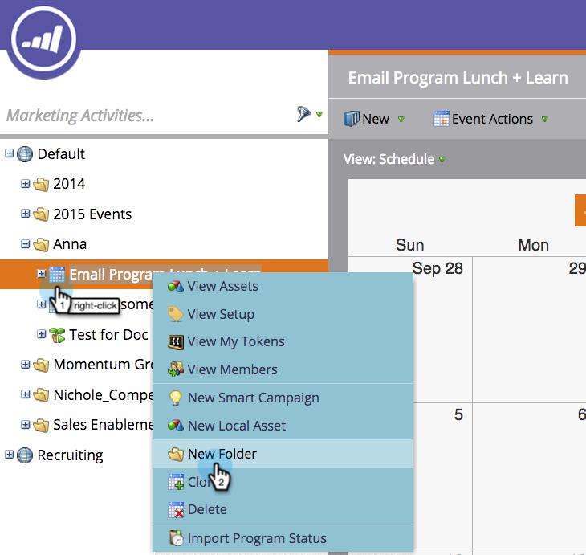
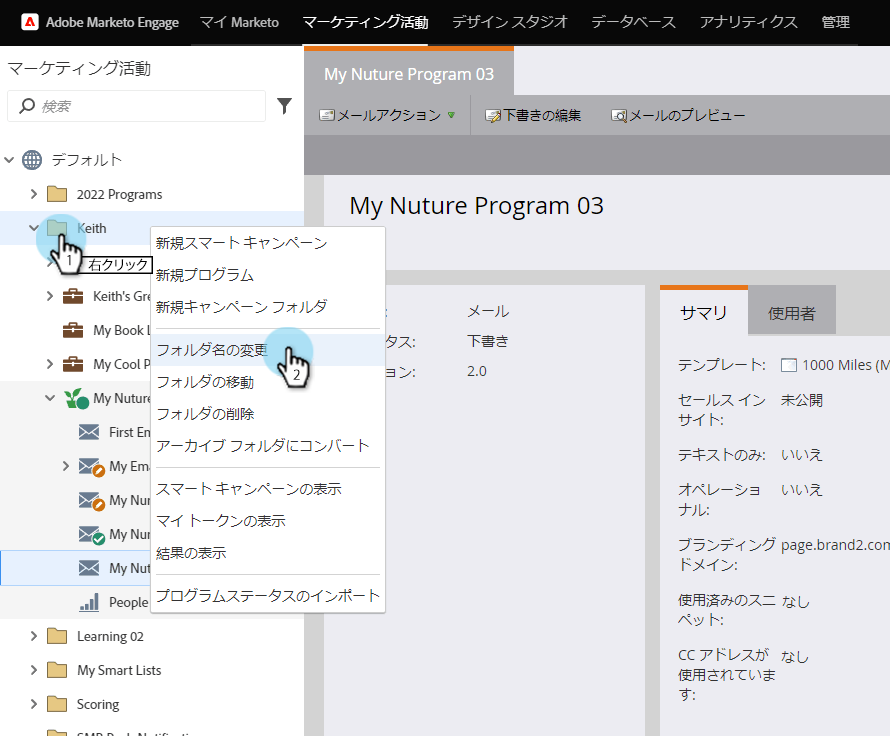
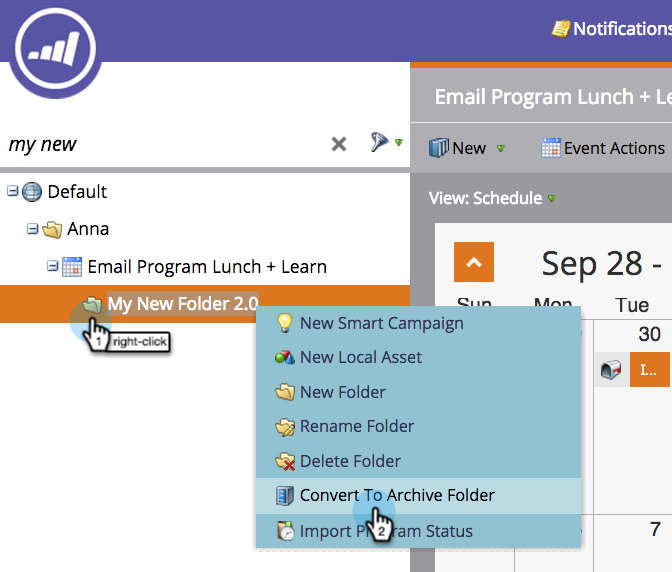

# フォルダーについて {#understanding-folders}

プログラム内のフォルダーを使用して、スマートキャンペーンとアセットを整理できます。 これらは[キャンペーンフォルダー](/help/marketo/product-docs/core-marketo-concepts/miscellaneous/create-new-campaign-folder.md)とは異なります。

## フォルダーの作成 {#create-a-folder}

1. 「**[!UICONTROL マーケティング活動]**」領域に移動します。

   

1. プログラムを右クリックし、「**[!UICONTROL 新規フォルダー]**」を選択します。

   

1. 新しいフォルダーに名前を付け、**[!UICONTROL Enter]** を押します。

   

これで、新しいフォルダーがローカルアセットの準備ができました。

## フォルダーの名前変更 {#rename-a-folder}

1. フォルダーを右クリックし、「**[!UICONTROL フォルダー名を変更]**」を選択します。

   

1. 新しい名前を入力し、**[!UICONTROL Enter]** を押します。

   

## フォルダーの削除 {#delete-a-folder}

>[!NOTE]
>
>フォルダーを削除する前に、フォルダーが空であることを確認します。

1. フォルダーを右クリックし、「**[!UICONTROL フォルダーを削除]**」を選択します。

   

## フォルダーのアーカイブ {#archive-a-folder}

Marketo では、既存のフォルダーをアーカイブフォルダーに変換できます。 アーカイブフォルダーは、[!UICONTROL マーケティング活動]、[!UICONTROL データベース]、[!UICONTROL デザインスタジオ]に存在します。

フォルダーをアーカイブした場合、次のようになります。

* フォルダーとアセットが検索結果に表示されなくなります。 アーカイブされたフォルダー内にあるプログラムまたはイベントを検索すると、アーカイブされたフォルダーの折りたたまれたビューが返されます
* フォルダー内のアセットは自動候補に表示されなくなります
* アーカイブされたテンプレートは、Design Studio でメールまたはランディングページを作成する場合に使用できません
* アーカイブされたページは、ランディングページのテストグループでは使用できません

アーカイブ時に変更&#x200B;**されない**&#x200B;機能は次の通りです。

* アーカイブ済みフォルダー内の結果は、グローバル検索に含まれます
* 使用中のアセットは、アーカイブ後も引き続き機能します
* アーカイブ済みアセットは、レポートで使用するためにフィルターを使用して選択できます
* アーカイブ済みアセットは非アクティブ化されません。 実行を停止する場合は、非アクティブ化する必要があります
