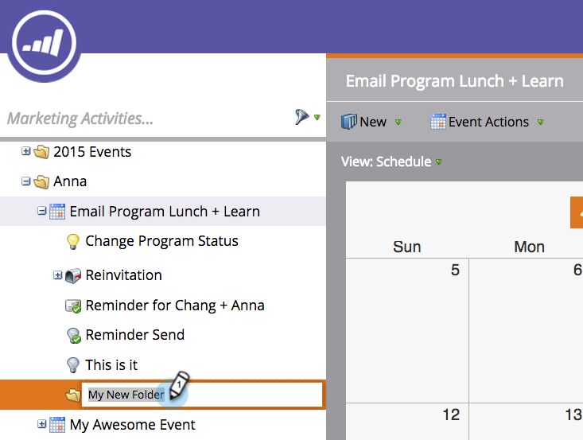
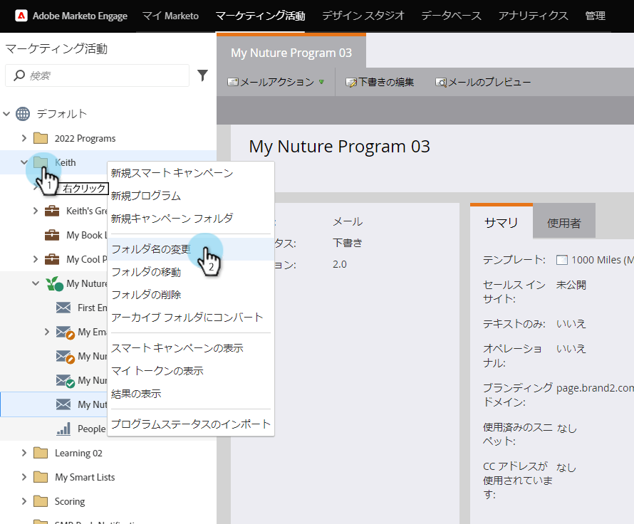

# フォルダーについて {#understanding-folders}

プログラム内のフォルダーを使用して、スマートキャンペーンとアセットを整理できます。 これらは[キャンペーンフォルダー](/help/marketo/product-docs/core-marketo-concepts/miscellaneous/create-new-campaign-folder.md)とは異なります。

## フォルダーを作成 {#create-a-folder}

1. 「**[!UICONTROL マーケティング活動]**」領域に移動します。

   

1. プログラムを右クリックし、「**[!UICONTROL 新規フォルダー]**」を選択します。

   {width="600" zoomable="yes"}

1. 新しいフォルダーに名前を付け、**[!UICONTROL Enter]** を押します。

   {width="600" zoomable="yes"}

これで、新しいフォルダーがローカルアセットの準備ができました。

## フォルダー名の変更 {#rename-a-folder}

1. フォルダーを右クリックし、「**[!UICONTROL フォルダー名を変更]**」を選択します。

   {width="600" zoomable="yes"}

1. 新しい名前を入力し、**[!UICONTROL Enter]** を押します。

   {width="600" zoomable="yes"}

## フォルダーの削除 {#delete-a-folder}

>[!NOTE]
>
>フォルダーを削除する前に、フォルダーが空であることを確認します。

1. フォルダーを右クリックし、「**[!UICONTROL フォルダーを削除]**」を選択します。

   {width="600" zoomable="yes"}

## フォルダーのアーカイブ {#archive-a-folder}

Marketo では、既存のフォルダーをアーカイブフォルダーに変換できます。 アーカイブフォルダーは、[!UICONTROL マーケティング活動]、[!UICONTROL データベース]、[!UICONTROL デザインスタジオ]に存在します。

{width="600" zoomable="yes"}

フォルダーをアーカイブした場合、次のようになります。

* フォルダーとアセットが検索結果に表示されなくなります。 アーカイブされたフォルダー内にあるプログラムまたはイベントを検索すると、アーカイブされたフォルダーの折りたたまれたビューが返されます
* フォルダー内のアセットは自動候補に表示されなくなります
* アーカイブされたテンプレートは、Design Studio でメールまたはランディングページを作成する場合に使用できません
* アーカイブされたページは、ランディングページのテストグループでは使用できません

アーカイブ時に変更&#x200B;**されない**&#x200B;機能は次の通りです。

* アーカイブ済みフォルダー内の結果は、グローバル検索に含まれます
* アーカイブ済みアセットは、レポートで使用するためにフィルターを使用して選択できます

### アーカイブでのキャンペーンの無効化 {#disable-campaigns-archive}

フォルダーまたはプログラムがアーカイブされた場合、またはアクティブなスマートキャンペーンが既にアーカイブされているフォルダーに移動された場合、Marketo Engageは影響を受けるキャンペーンの実行を停止します。

* **トリガーされたキャンペーン**&#x200B;は非アクティブ化されています。
* **バッチキャンペーン**&#x200B;の保留中の実行がキャンセルされました。
* **実行可能なキャンペーン**&#x200B;には実行状態がないため、アクションは実行されません。

**サポートされているアクション**

次のアクションでキャンペーンを非アクティブ化します。

* アクティブなキャンペーンを含む&#x200B;**フォルダー**&#x200B;をアーカイブされたフォルダーにドラッグ&amp;ドロップする
* アクティブなキャンペーンを含む&#x200B;**プログラム** （任意のタイプ）をアーカイブされたフォルダーにドラッグ&amp;ドロップする
* **単一のスマートキャンペーン**&#x200B;をアーカイブされたフォルダーにドラッグ&amp;ドロップする
* 単一のスマートキャンペーンの&#x200B;**Move**&#x200B;をアーカイブされたフォルダーに右クリックします
* アクティブなキャンペーンを含むフォルダーの&#x200B;**フォルダー**&#x200B;をアーカイブされたフォルダーに右クリックします
* アクティブなキャンペーンを含むプログラムの&#x200B;**Move**&#x200B;をアーカイブされたフォルダーに右クリックします
* フォルダー上の&#x200B;**アーカイブ済みフォルダー**&#x200B;に変換を右クリックすると、フォルダーを移動せずにアーカイブできます

>[!NOTE]
>
>アーカイブ中のフォルダーまたはプログラム内のスマートキャンペーンが別の場所で参照されている場合（例：「キャンペーンのリクエスト」フローステップを介して）、アーカイブはブロックされ、その他のキャンペーンが壊れるのを防ぎます。
