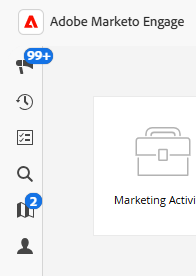
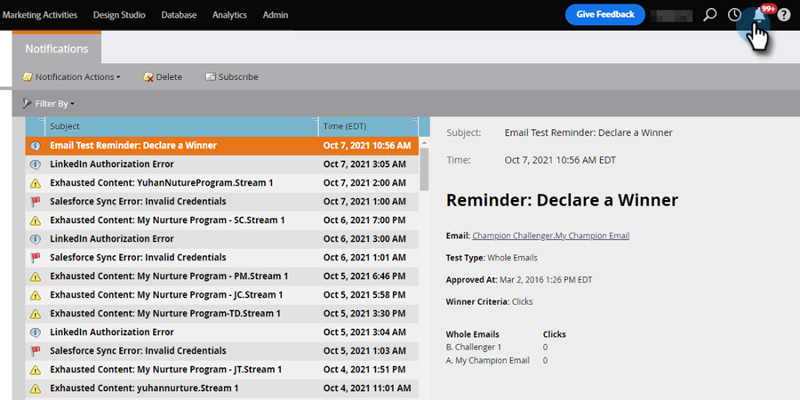
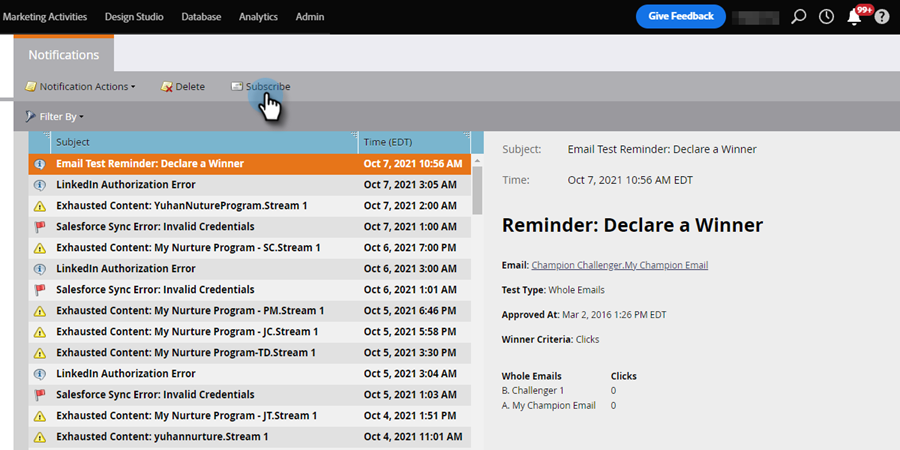

# 通知について {#understanding-notifications}

通知により、Marketo Engage サブスクリプションで発生するシステムイベントに関する最新情報が得られます。 例えば、Campaign の失敗通知は、スマートキャンペーンのエラーを通知し、CRM 同期通知は、CRM 同期で見つかった重要な問題（権限の誤りや同期の停止など）を警告します。

## 概要 {#overview}

1. 新しい通知は、Marketo Engageの左上に表示されます。

   

1. _通知_ アイコンをクリックして、すべての通知を表示します。

   {width="800" zoomable="yes"}

## 通知の配信登録 {#subscribe-to-notifications}

配信登録すると、通知をメールで受信できます。

1. _通知_ 画面で、「**[!UICONTROL 購読]**」をクリックします。

   

1. _通知の種類_ と _Workspace_ を選択します。 通知の送信先のメールアドレスを入力します（複数を追加する場合は、コンマで区切ります）。 終了したら「**[!UICONTROL 配信登録]**」をクリックします。

   

>[!NOTE]
>
>_[!UICONTROL 送信先]_ ボックスに入力できるのは、メールアドレスのみです。既存の購読者のリストは表示されません。

場合によっては、Microsoft Dynamics 同期エラーファイルなど、コンマ区切り値（CSV）ファイルをダウンロードするための「完全なリストを表示」リンクが通知に表示されることがあります。Marketo Engageでは、これらの CSV ファイルが 30 日間保持されます。 それ以降にファイルをダウンロードしようとすると、404 エラーが発生します。

>[!TIP]
>
>通知メールを登録解除するのも簡単です。通知メールの下部にある **[!UICONTROL 通知から登録解除]** リンクをクリックするだけです。
