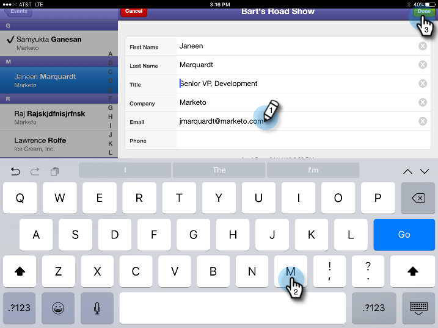

# タブレットからイベントへの人物のチェックイン {#check-people-into-your-event-from-your-tablet}

人物がイベントに参加したとき、アプリで人物の情報を確認できます。チェックイン後、Marketo と同期すると、参加済みステータスに昇格されます。

>[!IMPORTANT]
>
>2023 年 10 月 2 日（PT）に、AdobeはすべてのアプリストアからMarketo Events アプリを削除しました。 タブレット/モバイルデバイスにアプリが既にインストールされている場合は、当面の間そのアプリを使用し続けることができます。 Marketoの認証のためにMarketo Engage インスタンスがAdobe ID に移行されると、アプリにアクセスできなくなります。 [詳細情報](https://nation.marketo.com/t5/product-discussions/marketo-events-app-and-marketo-moments-app-end-of-life/m-p/340712/highlight/true#M193869){target="_blank"}

アプリは、[!DNL iPad] と [!DNL Android] の両方で同じように機能します。ただし、レイアウトやデザインの小さな違いを除きます。

>[!PREREQUISITES]
>
>* Marketo でイベントを作成し、招待済みの人物および登録済みの人物を設定します。

## 登録ゲストのチェックイン {#check-in-registered-guests}

1. [!DNL iPad] または [!DNL Android] タブレットのアプリアイコンをタップします。

1. 「**[!UICONTROL ログイン]**」をタップして、Marketo Event アプリを起動します。

   

1. Marketo のユーザー名とパスワードを入力し、「**[!UICONTROL ログイン]**」をクリックします。

   >[!NOTE]
   >
   >アプリ内の人物を表示するには、データベースへのアクセス権を持つ役割が必要です。

1. **[!UICONTROL イベント]**&#x200B;を選択します。

   

   >[!TIP]
   >
   >イベントプログラム（ウェビナーを除く）は、今日の日付の 1 週間前から 1 週間後までにスケジュールされているもののみ表示されます。

1. ホーム画面で、登録済みゲストを参照して見つけます。リスト内の人物を検索するには、次の操作を実行します。

   * スクロールして名前を検索
   * 検索フィールドに名前を入力
   * リストの右側で、特定の姓の頭文字にジャンプ

   >[!NOTE]
   >
   >プロセスは [!DNL iPad] と [!DNL Android] では同じですが、画面が異なり、項目の場所が異なる場合があります。 この記事では、[!DNL iPad] インターフェイスを取り上げます。 参照用に、このセクションの [!DNL Android] 画面を比較してください。

   **[!DNL iPad]**

   

   **[!DNL Android]**

   

1. 選択した名前をタップし、人物のレコードで「**[!UICONTROL チェックイン]**」をタップします。

   

ゲストのステータスが「出席済み」になり、チェックマークが付きます。Marketo と同期すると、その人物のレコードが更新されます。「同期」ボタンの赤いカウンターが増分され、Marketo との最後の同期以降のチェックイン数が表示されます。同期ボタンは表示が異なり、[!DNL iPad] と [!DNL Android] で異なる場所にあります。

**[!DNL iPad]**

**[!DNL Android]**

>[!TIP]
>
>招待されたが登録されていない人物の場合は、検索ボックスのすぐ下の「**[!UICONTROL サーバーで検索]**」をクリックして名前を検索できます。招待ステータスが「**[!UICONTROL 出席済み]**」に変わります。

## タブレットで新しい人物を作成 {#create-a-new-person-on-the-tablet}

Marketo データベースに存在していない人物を手動で追加できます。Marketo との同期時に自動的にチェックインされ、データベースに追加されます。

1. 「**[!UICONTROL 追加]**」をクリックします。

   **[!DNL iPad]**

   

   **[!DNL Android]**

   

1. できるだけ多くの基本情報フィールドに入力し、「**[!UICONTROL 完了]**」をタップします。

   

   >[!NOTE]
   >
   >既存フィールドのみ使用できます。カスタムフィールドは作成できません。

   >[!CAUTION]
   >
   >メールアドレスをダブルチェックします。その他のフィールドは後で修正できますが、メールアドレスは、ゲストに問い合わせるメインの方法です。

新しい人物はイベントにチェックインした状態で登録され、Marketo に同期すると「出席済み」ステータスで Marketo データベースに追加されます。

## チェックインの取り消し {#reverse-a-check-in}

_Marketoと同期する前に_ ユーザーを誤ってチェックインした場合は、[!UICONTROL  出席 ] ステータスを元に戻すことができます。

1. リスト内の名前をタップし、人物のレコードで「**[!UICONTROL 取り消し]**」をタップします。

   

   修正されました。

## チェックイン時に人物レコードを編集 {#edit-a-person-record-at-check-in}

イベントの直前に、ゲスト情報を追加および変更できます。

1. 人物リストで名前をタップし、「**[!UICONTROL 編集]**」をタップします。

   

1. フィールドを編集して情報を追加し、「**[!UICONTROL 完了]**」をタップします。

   

   >[!NOTE]
   >
   >[!DNL Android] では、「**[!UICONTROL 完了]** ボタンは非表示になっている場合があります。 下にスクロールして見つけます。

アプリを Marketo と同期すると、情報が更新されます。

## アプリと Marketo の同期 {#sync-the-app-with-marketo}

Marketo Events アプリは、アクティビティを Marketo データベースに同期するまで、独立して動作します。最後のチェックインの後、できるだけ早く同期することをお勧めします。タブレットがインターネットに接続されている必要があります。

>[!CAUTION]
>
>同期後にアプリからチェックインを取り消すことはできません。

1. タブレットでアプリを開き、イベントに移動します。

1. 「**[!UICONTROL 同期]**」をタップします。

   イベントが更新され、Marketo データベースの新しいチェックインが追加されます。「同期」ボタンの赤いカウンターは、他の人物をチェックインするまで消去されます。

   セキュリティ上の理由から、同期が完了したら Marketo Events アプリを終了する必要があります。

## 制限されたインターネットアクセスでの使用 {#working-with-limited-internet-access}

一部の会場では、インターネットへのアクセスが低下している場合があります。次の操作を実行するには、適切な接続が必要です。

* アプリのダウンロードとインストール
* ログイン
* イベントの選択
* アプリと Marketo の同期

会場でのインターネットアクセスが気になる場合は、Marketo Events アプリにログインし、強力なインターネットアクセスを備えた場所で、事前にイベントを選択しておくことをお勧めします。そうすれば、アプリをオフラインで引き続き使用できます。その後、インターネット接続を再び確立したときに、すぐに Marketo データベースに同期します。

>[!TIP]
>
>インターネットに接続していない場合でも、チェックインする人物の人物データを作成できます。アプリを同期すると、既存の人物と紐付けされます。

>[!NOTE]
>
>無操作状態が 8 時間続くと自動的にログアウトします。
