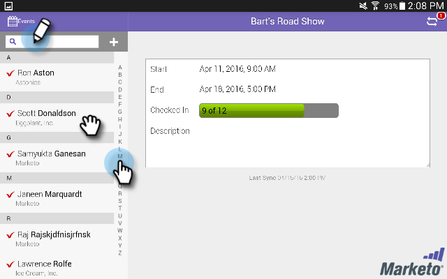
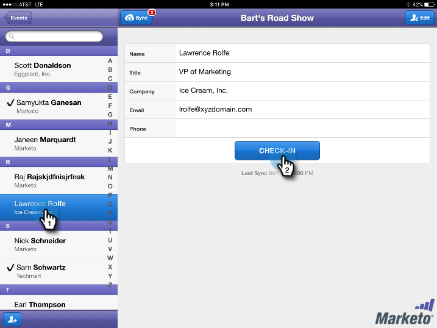

# タブレットからイベントにユーザーをチェックインする{#check-people-into-your-event-from-your-tablet}

ユーザーがイベントーに表示されると、アプリでそのユーザーの情報を見つけることができます。 チェックイン後、Marketorと同期すると、チェックイン者は「出席」ステータスに昇格します。

このアプリケーションは、レイアウトとデザインの小さな違いを除いて、iPadとAndroidの両方で同じように機能します。

>[!PREREQUISITES]
>
>* Marketorでイベントを作成し、招待ユーザーおよび登録ユーザーを使用して設定します。
>* [Android](https://play.google.com/store/apps/details?id=com.marketo.eventcheckin&amp;hl=en)または[iOS](https://itunes.apple.com/us/app/marketo-events/id522766637?mt=8)用のタブレットアプリをダウンロードする

>

## 登録ゲストをチェックイン{#check-in-registered-guests}

1. iPadまたはAndroidタブレットでアプリアイコンをタップします。
1. 「**ログイン**」をタップして、Marketorイベントアプリを起動します。

   

1. Marketoのユーザー名とパスワードを入力し、「**ログイン**」をクリックします。

   >[!NOTE]
   >
   >アプリ内のユーザーを表示するには、データベースへのアクセス権を持つロールが必要です。

1. **イベント**&#x200B;を選択します。

   

   >[!TIP]
   >
   >前の1週間と今日の日付の1週間後にスケジュールされたイベントプログラム（ウェビナーを除く）のみが表示されます。

1. ホーム画面で、登録済みゲストを参照して探します。 リスト内の人物を検索するには、次の操作を行います。

   * スクロールして名前を見つけます
   * 検索フィールドに名前を入力します
   * リストの右側で最後の名前の最初の文字をタップして、名前の最初の文字にジャンプする

   >[!NOTE]
   >
   >処理はiPadとAndroidで同じですが、画面は異なり、項目が異なる場所にある場合があります。 この記事では、iPadのインターフェイスについて説明します。 この節のAndroid画面を比較して参照してください。

   **iPad** 

   **Android**

   

1. 選択した名前をタップし、ユーザーレコードで「**チェックイン**」をタップします。

   

ゲストは「出席」ステータスになり、チェックマークが付きます。 人物レコードは、Marketoと同期すると更新されます。 「同期」ボタンの赤いカウンターは、前回のマーケティング担当者との同期以降のチェックイン数を示すために増加します。 同期ボタンの外観が異なり、iPadとAndroidでは別の場所にあります。

**iPad**

**Android**

>[!TIP]
>
>ユーザーが招待されても登録されていない場合は、「検索」ボックスの下にある「**サーバーで検索**」をクリックして名前を検索できます。 招待ステータスがイベントの&#x200B;**出席**&#x200B;に変わります。

## タブレットでの新しいユーザーの作成{#create-a-new-person-on-the-tablet}

Marketoデータベースには、既存のユーザーでないゲストを手動で追加できます。 Marketoと同期すると、ユーザーは自動的にチェックインされ、データベースに追加されます。

1. **追加**&#x200B;をクリックします。

   **iPad**

   

   **Android**

   

1. 基本情報のフィールドにできるだけ入力を行い、「**完了**」をタップします。

   

   >[!NOTE]
   >
   >既存のフィールドのみを使用できます。 カスタムのカスタムのものは作成できません。

   >[!CAUTION]
   >
   >電子メールアドレスを重複確認します。 その他のフィールドは後で修正できますが、主にゲストに連絡する方法は電子メールアドレスです。

新しいユーザーがイベントにチェックイン済みとして登録され、Marketoと同期すると、ステータスが「有人」のMarketoデータベースに追加されます。

## チェックインを反転{#reverse-a-check-in}

誤ってユーザーをチェックインした場合、Marketo *と同期する前に*、出席ステータスを反転できます。

1. リスト内の名前をタップし、ユーザーレコード内で&#x200B;**「元に戻す**」をタップします。

   

   全速力！

## チェックイン時の個人レコードの編集{#edit-a-person-record-at-check-in}

イベントでゲスト情報を追加および変更できます。

1. 人物リストの名前をタップし、**編集**&#x200B;をタップします。

   

1. フィールドを編集して情報を追加し、**完了**&#x200B;をタップします。

   

   >[!NOTE]
   >
   >Androidでは、「**完了**」ボタンが非表示になっている場合があります。 下にスクロールして見つけます。

アプリをMarketoと同期すると、情報が更新されます。

## アプリをMarketorと同期{#sync-the-app-with-marketo}

Marketoイベントアプリは、アクティビティをMarketo Databaseと再び同期するまで、独立して動作します。 最後のチェックイン後、できるだけ早く同期することをお勧めします。 タブレットがインターネットに接続されている必要があります。

>[!CAUTION]
>
>同期後は、アプリからチェックインを取り消すことはできません。

1. タブレットでアプリを開き、イベントーに移動します。
1. 「**同期**」をタップします。

   イベントがMarketoデータベースの新しいチェックインで更新されます。 「同期」ボタンの赤いカウンターは、他のユーザーがチェックインするまでクリアされます。

   セキュリティ上の理由から、同期が完了した後でMarketoイベントアプリを終了する必要があります。

## 制限付きインターネットアクセスの使用{#working-with-limited-internet-access}

インターネットに接続できない会場もあります。 次に適切な接続が必要です。

* アプリのダウンロードとインストール
* ログイン
* イベントの選択
* アプリとMarketoの同期

会場でのインターネットアクセスが問題となる場合は、Marketoイベントアプリにログインし、強力なインターネットアクセスを持つ場所で、事前にイベントを選択することをお勧めします。 この方法では、アプリをオフラインで使用できます。 次に、インターネット接続が回復したら、すぐにMarketoデータベースに同期します。

>[!TIP]
>
>インターネットに接続していない場合でも、チェックインするユーザーに対して新しいユーザーを作成できます。 アプリを同期すると、既存のユーザーと調整されます。

>[!NOTE]
>
>無操作状態が8時間続くと、自動的にログアウトします。

