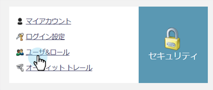
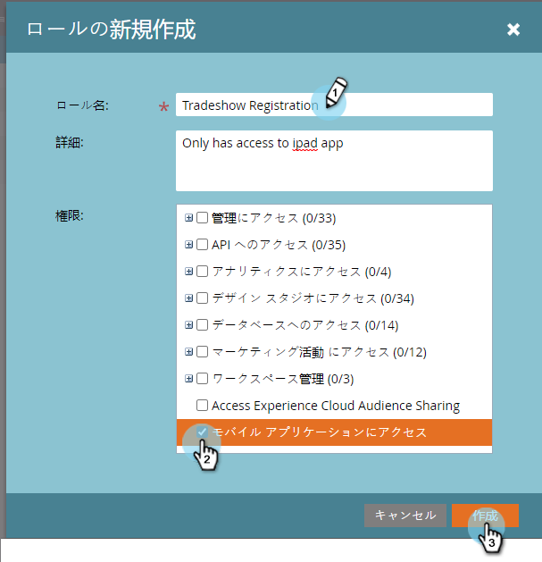
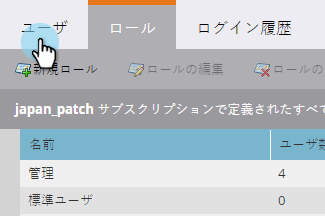

# チェックインアプリへのユーザーアクセスを許可する{#grant-users-access-to-the-check-in-app}

Marketorには、イベントのチェックインアプリに対する特別なユーザーの役割があります。 アプリを使用する権限を持つ新しいロールを作成する方法を次に示します。

## モバイル用の新しいユーザーロールの作成{#create-a-new-user-role-for-mobile}

1. 「**管理者**」をクリックします。

   

1. 「**ユーザーとロール**」をクリックします。

   

1. 「**ロール**」タブをクリックし、「**新しいロール**」をクリックします。

   

1. 新しいロールの名前と、オプションで説明を入力します。 「**モバイルアプリケーションにアクセス**」ボックスをオンにし、「**作成**」をクリックします。

   

   ユーザーをタブレットアプリを使用するように招待した場合は、新しいロールを割り当てる準備が整っています。

## チェックインアプリの新しいユーザーの招待{#invite-new-users-for-the-check-in-app}

1. 「**ユーザー**」タブをクリックします。

   

1. 「**新しいユーザーを招待**」をクリックします。

   

1. 新しいユーザーの情報を入力します。 該当するすべてのロールと、モバイルアプリへのアクセス権限を持つ新しいロールのチェックボックスを選択します。 終了したら、「**招待**」をクリックします。

   

   >[!CAUTION]
   >
   >データベースにアクセスできないユーザーは、アプリ内のどのユーザーも表示できません。

   >[!TIP]
   >
   >既存のユーザーの場合は、新しいロールを作成するか、現在のロールにAccess Mobile Application権限を追加できます。

ユーザーには、チェックインアプリへのアクセス権を持っていることを伝える電子メールが届きます。