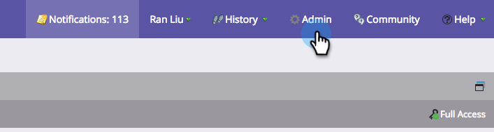
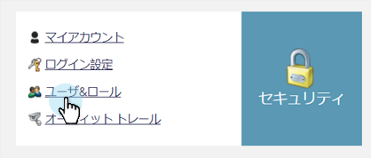
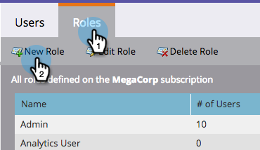
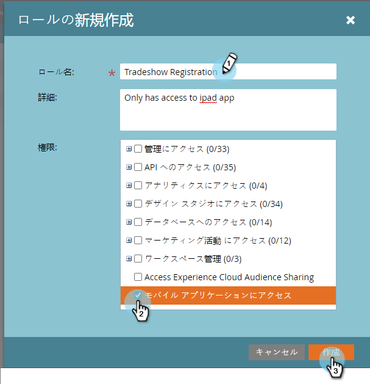
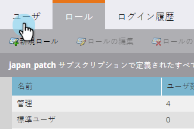
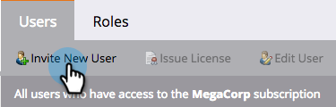
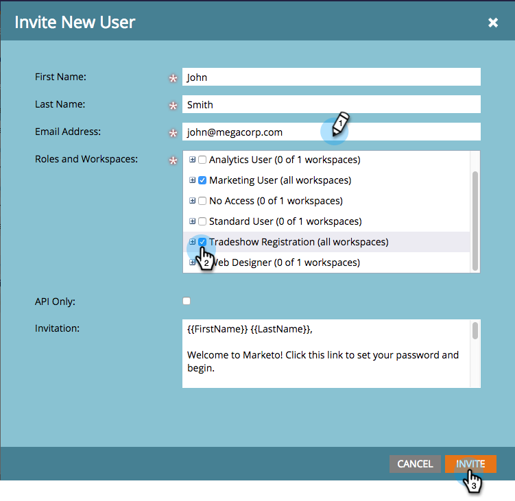

# チェックインアプリに対するアクセス権をユーザーに付与する {#grant-users-access-to-the-check-in-app}

Marketo Engage には、イベントチェックインアプリ用の特別なユーザロールがあります。 次の手順に従って、アプリを使用する権限を持つ新しい役割を作成します。

>[!IMPORTANT]
>
>2023年10月2日（PT）に、アドビは Marketo イベントアプリをすべてのアプリストアから削除しました。 タブレット／モバイルデバイスにアプリが既にインストールされている場合は、当面は引き続き使用できます。 Marketo Engage インスタンスが、Marketo の認証に Adobe Identity を使用するように移行されると、アプリにアクセスできなくなります。 [詳細情報](https://nation.marketo.com/t5/product-discussions/marketo-events-app-and-marketo-moments-app-end-of-life/m-p/340712/highlight/true#M193869){target="_blank"}。

## モバイル用の新しいユーザーロールを作成する {#create-a-new-user-role-for-mobile}

1. 「**[!UICONTROL 管理者]**」をクリックします。

   

1. 「**[!UICONTROL ユーザーと役割]**」をクリックします。

   

1. 「**[!UICONTROL 役割]**」タブをクリックし、「**[!UICONTROL 新しい役割]**」をクリックします。

   

1. 新しいロールの名前と説明（オプション）を入力します。 「**[!UICONTROL モバイルアプリケーションにアクセス]**」ボックスをオンにして、「**[!UICONTROL 作成]**」をクリックします。

   

   タブレットアプリにユーザを招待できるようになると、新しいロールを割り当てる準備が整います。

## チェックインアプリ用の新しいユーザを招待する {#invite-new-users-for-the-check-in-app}

1. 「**[!UICONTROL ユーザー]**」タブをクリックします。

   

1. 「**[!UICONTROL 新しいユーザーを招待]**」をクリックします。

   

1. 新しいユーザーの情報を入力します。 すべての適切なロールのチェックボックスと、モバイルアプリへのアクセス権限を持つ新しいロールを選択します。 完了したら、**[!UICONTROL 招待]**&#x200B;をクリックします。

   

   >[!CAUTION]
   >
   >データベースにアクセスできないユーザーは、アプリ内の人物を表示できません。

   >[!TIP]
   >
   >既存のユーザの場合は、新しいロールを作成するか、現在のロールに[!UICONTROL モバイルアプリケーションへのアクセス]権限を追加できます。

ユーザーには、チェックインアプリへのアクセス権を持っていることを知らせるメールが届きます。
