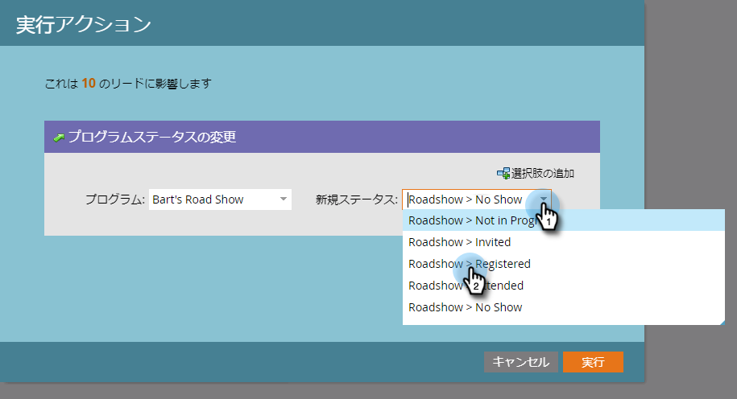

# イベントの準備 {#prepare-for-your-event}

イベントの準備をするために必要なことがいくつかあります。

## 新しいマーケティング担当者ロールの作成 {#create-a-new-marketo-role}

Marketorには、イベントのチェックインアプリに対する特別なユーザーの役割があります。  [iPadまたはAndroidユーザー向けに、モバイルアプリケーションへのアクセス権を持つ新しいMarketoのロール](https://docs.marketo.com/display/DOCS/Grant+User+Access+to+the+Check-in+App) を作成します。

## 新しいタブレットユーザーのイベントへの招待 {#invite-new-tablet-users-to-the-event}

[新しいタブレットユーザーをイベントに招待し](https://docs.marketo.com/display/DOCS/Grant+User+Access+to+the+Check-in+App) 、新しい役割を割り当てます。

## 新しいマーケティングイベントプログラムの作成 {#create-a-new-marketo-event-program}

[様々な段階を進むにつれて訪問者のステータスを把握し、マーケティングイニシアチブのROIを正確に測定するための新しいマーケティングイベントプログラムを作成します。](/help/marketo/product-docs/demand-generation/events/understanding-events/create-a-new-event-program.md)

## イベント日の指定 {#specify-the-event-dates}

イベントの日付を設定するのは簡単です。

1. スケジュール上のイベントをクリックし、開始と終了日時を設定します。

   

1. スライドオーバーして **「仮予定** 」を「 **確認済み**」に変更します。

   

   >[!CAUTION]
   >
   >イベントの日付が現在の日付の1週間前またはそれ以降の場合、イベントはアプリに表示されません。 **ヒント**:テストするには、一時的に日付を今日から1週間以内に設定します。 イベントをテストした後は、必ず正しい日付に戻してください。

## イベント追加のユーザー {#add-people-to-your-event}

いつ *かが分かったので*、 *誰かを追加する時だ*。

1. ユーザーのリストが既に存在する場合は、「マイマーケティング」で「 **データベース** 」タイルをクリックします。

   

1. ユーザーのあるリストを選択し、「 **ユーザー** 」タブをクリックします。

   

1. リストからイベントのユーザーを選択します。 複数のユーザーをクリックするには **Ctrl** (Macでは **Command** )を使用し、すべてのユーザーをマークするには「すべて **選択** 」を選択します。

   

1. 「 **個人アクション**」をクリックし、 **プログラムの上にマウスポインターを置いて** 、「プログラムステータス **を変更**」を選択します。

   

1. 「 **プログラム** 」ドロップダウンリストをクリックし、イベントを選択します。

   

1. 「 **New Status** 」ドロップダウンをクリックし、「 **Roadshow」>「Registered**」を選択します。 「今すぐ **実行**」をクリックします。

   

1. 小さいウィンドウに進行状況が表示されます。

   

1. ...とは、タスクがいつ完了したかを示します。

   

   選択したユーザーがイベントに登録され、トレードショーのフロアにあるタブレットアプリを使用してチェックインできる状態になります。
